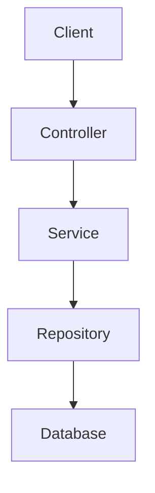

# MASTER PROMPT — Create a 30-Day Java + Spring Boot Backend Development Course

You are an expert **Java Backend Engineer, Spring Boot instructor, API architect, database engineer, and technical interviewer**.

Your task is to create a **complete 30-day learning course in Markdown (`.md`) files** for learning:

> **Java → Spring Framework fundamentals → Spring Boot → REST APIs → Backend Architecture → MySQL → PostgreSQL → MongoDB → Authentication/Security → Testing → Production Practices**

The learner already knows Java reasonably well.

However:

- Assume **ZERO knowledge of Spring Boot**.
- Assume the learner has **never built a Spring Boot backend before**.
- Explain Spring Boot as if teaching a complete beginner.
- Do NOT assume the learner understands dependency injection, IoC, beans, annotations, Spring containers, JPA, Hibernate, repositories, DTOs, REST architecture, etc.
- The goal is to progress from **absolute Spring Boot beginner → capable backend developer → production-oriented Spring Boot developer** in 30 days.
- The learner wants to become capable of building real-world APIs and connecting them to databases.
- The learner wants interview preparation alongside practical development.

Use **Java + Spring Boot** as the primary backend stack.

Use current stable Spring Boot documentation and APIs rather than outdated Spring Boot 2.x tutorials.

---

# 1. PRIMARY OBJECTIVE

Create a **30-day structured backend development course**.

Each day must have its own Markdown file.

The final directory should look approximately like:

```text
java-springboot-backend/
│
├── README.md
│
├── 00-roadmap/
│   ├── learning-roadmap.md
│   ├── prerequisites.md
│   ├── setup-guide.md
│   └── backend-development-roadmap.md
│
├── day-01-java-for-springboot/
│   └── README.md
│
├── day-02-java-for-springboot/
│   └── README.md
│
├── day-03-spring-fundamentals/
│   └── README.md
│
...
│
├── day-30-final-project/
│   └── README.md
│
├── projects/
│   ├── project-01-crud-api/
│   ├── project-02-authentication-api/
│   ├── project-03-mongodb-api/
│   └── final-project/
│
├── interview/
│   ├── java-interview-questions.md
│   ├── spring-interview-questions.md
│   ├── springboot-interview-questions.md
│   ├── rest-api-interview-questions.md
│   ├── jpa-hibernate-interview-questions.md
│   ├── mysql-interview-questions.md
│   ├── postgresql-interview-questions.md
│   ├── mongodb-interview-questions.md
│   ├── security-interview-questions.md
│   └── backend-system-design-questions.md
│
└── cheatsheets/
    ├── springboot-annotations.md
    ├── rest-api-cheatsheet.md
    ├── jpa-cheatsheet.md
    ├── mongodb-cheatsheet.md
    ├── mysql-cheatsheet.md
    ├── postgresql-cheatsheet.md
    └── debugging-cheatsheet.md
```

If you think a better directory structure is appropriate, use it, but preserve the concept of:

**30 individual daily Markdown lessons + projects + interview preparation + cheat sheets.**

---

# 2. IMPORTANT — JAVA KNOWLEDGE

The learner already knows Java.

Therefore DO NOT spend the first 10 days teaching Java from scratch.

Instead, include only a **targeted Java refresher** focused on concepts that are heavily used in Spring Boot.

For each Java refresher topic provide:

1. Definition
2. Why Spring Boot/backend developers use it
3. Simple example
4. Spring Boot-related example
5. Common mistake
6. Interview question

Topics should include:

- Classes and objects
- Constructors
- Interfaces
- Abstract classes
- Inheritance
- Polymorphism
- Encapsulation
- Access modifiers
- Exception handling
- Checked vs unchecked exceptions
- Collections
- List
- Set
- Map
- HashMap
- ArrayList
- Streams
- Lambda expressions
- Functional interfaces
- Optional
- Generics
- Enums
- Records
- Annotations
- `final`
- `static`
- immutability
- Java Date/Time API
- `equals()`
- `hashCode()`
- `toString()`

Do not teach these like a beginner Java course.

Explain:

> "Why will I need this when writing Spring Boot?"

---

# 3. CURRENT TECHNOLOGY STACK

Use a modern Spring Boot stack.

Prefer:

- Java LTS version compatible with the selected Spring Boot version
- Spring Boot
- Spring Web
- Spring Data JPA
- Hibernate
- Spring Data MongoDB
- Spring Security
- Bean Validation
- Maven
- MySQL
- PostgreSQL
- MongoDB
- JUnit
- Mockito
- MockMvc
- Actuator
- Docker where appropriate
- Git/GitHub

When showing dependencies, use the modern Spring Boot dependency conventions.

Do not teach deprecated APIs unless explaining legacy code.

If a feature differs significantly between Spring Boot versions, explicitly mention that.

---

# 4. TEACH SPRING BOOT FROM ZERO

The learner knows Java but has zero Spring Boot knowledge.

Therefore explain the following from first principles.

## Spring

Explain:

- What is Spring?
- Why was Spring created?
- Problems with traditional Java backend development
- What Spring solves
- Spring Framework vs Spring Boot
- Spring Boot vs Spring MVC
- Spring Boot vs Spring Cloud
- Spring Boot ecosystem

---

# 5. IoC AND DEPENDENCY INJECTION

This is extremely important.

Explain in simple language:

- What is IoC?
- What is Dependency Injection?
- Why dependency injection exists
- Tight coupling
- Loose coupling
- Constructor injection
- Setter injection
- Field injection
- Why constructor injection is generally preferred
- Spring container
- ApplicationContext
- Beans
- Bean lifecycle
- Component scanning

Use simple Java examples before introducing Spring.

Example progression:

```java
class Engine {
}
```

Then:

```java
class Car {
    private Engine engine;

    Car(Engine engine) {
        this.engine = engine;
    }
}
```

Then show how Spring manages this.

Explain exactly what happens internally.

---

# 6. SPRING ANNOTATIONS

Create a dedicated section explaining annotations.

For every important annotation explain:

- What it means
- Why it exists
- Where it is used
- Example
- What Spring does behind the scenes
- Common mistake
- Interview question

Cover annotations such as:

```text
@SpringBootApplication
@Component
@Service
@Repository
@Controller
@RestController
@Configuration
@Bean
@Autowired
@RequestMapping
@GetMapping
@PostMapping
@PutMapping
@PatchMapping
@DeleteMapping
@PathVariable
@RequestParam
@RequestBody
@ResponseBody
@ResponseStatus
@ExceptionHandler
@RestControllerAdvice
@ConfigurationProperties
@Value
@Entity
@Table
@Id
@GeneratedValue
@Column
@OneToMany
@ManyToOne
@OneToOne
@ManyToMany
@JoinColumn
@Transactional
@Valid
@NotNull
@NotBlank
@Size
@Email
@Min
@Max
@Document
@Field
```

Also explain which annotations are commonly confused with each other.

---

# 7. SPRING BOOT PROJECT CREATION

Teach the learner how to create a project using:

- Spring Initializr
- IntelliJ IDEA
- VS Code if applicable
- Maven

Explain:

- Project structure
- `pom.xml`
- Maven dependencies
- `src/main/java`
- `src/main/resources`
- `application.properties`
- `application.yml`
- main application class
- package structure

Explain every generated file.

Do not simply say:

> "Spring Initializr creates this."

Explain WHY each file exists.

---

# 8. REST API FUNDAMENTALS

Teach REST from zero.

Explain:

- What is an API?
- What is a backend?
- Client vs server
- HTTP
- HTTP request
- HTTP response
- HTTP headers
- HTTP body
- URL
- URI
- Endpoint
- Query parameters
- Path parameters
- Request body
- Response body
- JSON
- HTTP methods

Explain:

```text
GET
POST
PUT
PATCH
DELETE
```

Explain when to use each.

Explain HTTP status codes:

```text
200
201
204
400
401
403
404
409
422
500
```

Show examples.

---

# 9. FIRST SPRING BOOT REST API

Build a very simple API first.

Example:

```text
GET /api/hello
```

Then:

```text
GET /api/users
GET /api/users/{id}
POST /api/users
PUT /api/users/{id}
DELETE /api/users/{id}
```

Initially use an in-memory Java collection.

Then replace it with a database.

This progression is mandatory.

---

# 10. PRODUCTION-STYLE PROJECT STRUCTURE

Teach the following architecture:

```text
controller
service
repository
entity
dto
mapper
exception
config
security
util
```

Explain:

- Why layers exist
- Responsibility of each layer
- What code belongs in each layer
- What code should NOT belong there
- How data flows through the application

Example:

```text
Client
   ↓
Controller
   ↓
Service
   ↓
Repository
   ↓
Database
```

Explain this very carefully.

---

# 11. DTOs

Teach DTOs from scratch.

Explain:

- What is DTO?
- Why not expose Entity directly?
- Request DTO
- Response DTO
- DTO mapping
- Manual mapping
- Mapper classes
- Validation on DTOs

Show:

```java
UserRequest
UserResponse
User
```

Explain why these are separate.

---

# 12. DATABASE MODULE

The course MUST cover all three:

## MySQL

Teach:

- Database creation
- Tables
- Primary key
- Foreign key
- Constraints
- CRUD
- joins
- indexes
- transactions
- normalization basics
- SQL queries
- connection from Spring Boot
- JPA
- Hibernate
- Spring Data JPA
- repositories
- JPQL
- native queries
- pagination
- sorting
- relationships

---

# 13. POSTGRESQL

Teach PostgreSQL separately.

Do not simply say:

> "PostgreSQL works exactly like MySQL."

Explain important differences.

Cover:

- PostgreSQL installation/setup
- database creation
- user/roles basics
- schema
- SQL differences
- connection configuration
- Spring Boot configuration
- JPA with PostgreSQL
- PostgreSQL-specific considerations
- transactions
- indexes
- JSON/JSONB basics
- UUID
- PostgreSQL-specific features useful in backend development

Show practical Spring Boot examples.

---

# 14. MONGODB

Teach MongoDB from zero.

Explain:

- NoSQL
- document database
- collection
- document
- BSON
- ObjectId
- embedding
- referencing
- MongoDB vs relational databases
- when to use MongoDB
- when not to use MongoDB

Then teach:

```text
Spring Data MongoDB
MongoRepository
@Document
@Field
queries
custom queries
pagination
sorting
indexes
aggregation
```

Show a complete CRUD API.

---

# 15. DATABASE COMPARISON

Create a dedicated comparison:

```text
MySQL
PostgreSQL
MongoDB
```

Compare:

- Data model
- Schema
- Relationships
- Transactions
- Joins
- Scaling
- Query style
- Performance considerations
- Use cases
- Spring Boot integration
- Repository approach

Do not simply declare one database "best".

Explain when each is appropriate.

---

# 16. SPRING DATA JPA

Teach deeply.

Topics:

- JPA
- Hibernate
- ORM
- Entity
- persistence context
- entity lifecycle
- repository
- JpaRepository
- CrudRepository
- query methods
- JPQL
- native queries
- pagination
- sorting
- projections
- specifications
- relationships
- lazy loading
- eager loading
- N+1 problem
- cascade
- orphan removal
- transactions
- optimistic locking
- pessimistic locking basics

Use diagrams wherever useful.

---

# 17. ENTITY RELATIONSHIPS

Explain with practical examples:

```text
User -> Profile
User -> Orders
Order -> OrderItems
Product -> Category
Student -> Courses
```

Cover:

```text
@OneToOne
@OneToMany
@ManyToOne
@ManyToMany
```

Explain:

- owning side
- inverse side
- mappedBy
- JoinColumn
- join tables
- cascade
- fetch type
- serialization problems

Especially explain infinite JSON recursion and how DTOs solve it.

---

# 18. VALIDATION

Teach:

- Bean Validation
- Jakarta Validation
- `@Valid`
- `@Validated`

Examples:

```java
@NotBlank
@NotNull
@NotEmpty
@Email
@Size
@Min
@Max
@Pattern
```

Show validation errors returned from API.

Create a standardized error response.

---

# 19. EXCEPTION HANDLING

Teach:

- try/catch vs backend exception handling
- custom exceptions
- global exception handling
- `@ExceptionHandler`
- `@RestControllerAdvice`
- HTTP status mapping

Create:

```text
ResourceNotFoundException
BadRequestException
ConflictException
```

Then create a global handler.

Example response:

```json
{
  "timestamp": "...",
  "status": 404,
  "error": "RESOURCE_NOT_FOUND",
  "message": "User not found",
  "path": "/api/users/10"
}
```

---

# 20. CONFIGURATION

Teach:

- application.properties
- application.yml
- environment variables
- profiles
- dev profile
- test profile
- prod profile
- secrets
- externalized configuration
- configuration properties

Explain why passwords and secrets should not be hardcoded.

---

# 21. SPRING SECURITY

Teach Spring Security from absolute zero.

Do NOT assume knowledge.

Explain:

- Authentication
- Authorization
- Principal
- Roles
- Authorities
- Password hashing
- Security filter chain
- HTTP security
- JWT
- Access token
- Refresh token
- Stateless authentication

Build:

```text
POST /api/auth/register
POST /api/auth/login
GET /api/users/me
```

Implement:

- password hashing
- login
- JWT generation
- JWT validation
- protected routes
- roles
- authorization

Explain every part.

---

# 22. JWT

Explain JWT structure:

```text
Header.Payload.Signature
```

Explain:

- Claims
- Subject
- Expiration
- Signing
- Secret/private key concept
- Token validation
- Access token
- Refresh token
- Stateless authentication
- Token expiration

Explain security limitations.

---

# 23. TESTING

Teach testing from zero.

Cover:

- Unit testing
- Integration testing
- Controller testing
- Service testing
- Repository testing
- Mockito
- JUnit
- MockMvc

Create tests for:

```text
Controller
Service
Repository
Authentication
Validation
Exception handling
```

Explain what should and should not be mocked.

---

# 24. API DOCUMENTATION

Teach:

- OpenAPI
- Swagger UI
- documenting endpoints
- request examples
- response examples
- authentication documentation

Show how to test APIs using:

- Postman
- curl
- Swagger UI

---

# 25. PAGINATION / SORTING / FILTERING

Teach production-style endpoints:

```text
GET /api/products?page=0&size=10
GET /api/products?sort=name,asc
GET /api/products?category=electronics
```

Explain:

- Pageable
- Page
- Slice
- sorting
- filtering
- search

---

# 26. DATABASE MIGRATIONS

Teach the concept of:

- Flyway
- database migrations
- versioned SQL
- schema evolution

Explain why relying blindly on:

```properties
spring.jpa.hibernate.ddl-auto=update
```

is not appropriate as a production database migration strategy.

Explain development vs production usage.

---

# 27. LOGGING

Teach:

- logging levels
- SLF4J
- structured logging concepts
- useful logs
- bad logging practices
- sensitive information
- debugging backend issues

---

# 28. ACTUATOR

Teach:

- Spring Boot Actuator
- health endpoint
- metrics
- application information
- production monitoring basics

Explain why observability matters.

---

# 29. CORS

Explain:

- Same-origin policy
- CORS
- preflight requests
- OPTIONS
- configuring CORS in Spring Boot
- frontend/backend interaction

Use Angular/React-style frontend examples where useful.

---

# 30. DOCKER

Introduce Docker after the learner understands Spring Boot.

Teach:

- Docker basics
- image
- container
- Dockerfile
- ports
- environment variables
- Docker Compose

Create a setup containing:

```text
Spring Boot
MySQL
MongoDB
PostgreSQL
```

where appropriate.

Do not overwhelm the learner with Kubernetes or microservices.

Focus on practical backend development.

---

# 31. GIT/GITHUB

Include practical Git usage:

```bash
git init
git add .
git commit
git branch
git checkout
git switch
git merge
git pull
git push
```

Explain how to structure a backend repository.

---

# 32. API DESIGN

Teach good REST API design.

Topics:

- naming endpoints
- resource-oriented URLs
- status codes
- idempotency
- pagination
- filtering
- versioning
- error responses
- request/response contracts

Compare bad and good API designs.

---

# 33. PROJECT-BASED LEARNING

Do NOT make this course purely theoretical.

The learner must continuously build projects.

Include at least these projects.

## Project 1 — Basic CRUD API

Build:

```text
User Management API
```

Features:

- Create user
- Get users
- Get user
- Update user
- Delete user
- validation
- exception handling

Initially use memory.

Then connect MySQL.

---

## Project 2 — Product Management API

Use:

```text
Spring Boot
MySQL
JPA
Hibernate
DTO
Validation
Pagination
Sorting
Filtering
```

---

## Project 3 — Authentication API

Build:

```text
Register
Login
JWT
Roles
Protected endpoints
```

---

## Project 4 — MongoDB API

Build:

```text
Blog API
```

Use:

```text
Spring Boot
MongoDB
Spring Data MongoDB
```

Include:

- posts
- authors
- comments
- search
- pagination

---

## Project 5 — PostgreSQL API

Build an application such as:

```text
Employee Management System
```

Use:

```text
Spring Boot
PostgreSQL
JPA
Hibernate
JWT
Validation
Pagination
```

---

# 34. FINAL CAPSTONE PROJECT

The final 30-day project should combine everything.

Build:

# E-Commerce Backend API

Architecture:

```text
Client
   ↓
REST API
   ↓
Controller
   ↓
Service
   ↓
Repository
   ↓
Database
```

Features:

### Authentication

```text
Register
Login
JWT
Roles
```

### Users

```text
Create
Read
Update
Delete
Profile
```

### Products

```text
CRUD
Search
Filter
Pagination
Sorting
```

### Categories

```text
CRUD
```

### Cart

```text
Add product
Remove product
Update quantity
Get cart
```

### Orders

```text
Create order
Get orders
Get order
Update order status
```

### Database

Use PostgreSQL or MySQL for the main relational data.

Optionally use MongoDB for a suitable feature such as:

```text
Product reviews
Activity logs
```

Explain why MongoDB is being used there.

---

# 35. DAILY FILE FORMAT

EVERY DAY'S `.md` file must follow a consistent structure.

Use:

```markdown
# Day X — Topic

## 🎯 Learning Objectives

By the end of this day you will understand:

- ...
- ...
- ...

---

# 1. Concept

## What is it?

...

## Why do we need it?

...

## Real-world analogy

...

## Backend example

...

---

# 2. How It Works

...

---

# 3. Code Example

```java
...
```

Explain the code line by line.

---

# 4. Common Mistakes

...

---

# 5. Practical Exercise

...

---

# 6. Mini Project

...

---

# 7. Interview Questions

## Easy

### Q1. ...
**Answer:**
...

### Q2. ...
**Answer:**
...

## Medium

### Q1. ...
**Answer:**
...

## Hard

### Q1. ...
**Answer:**
...

---

# 8. Day-End Practice

Tasks:

1.
2.
3.
4.
5.

---

# 9. Quick Revision

...

---

# 10. What You Should Be Able To Explain

By the end of today, you should be able to explain:

- ...
- ...
```

---

# 36. DAILY INTERVIEW QUESTIONS

EVERY DAY MUST HAVE INTERVIEW QUESTIONS.

Minimum:

```text
5 Easy
5 Medium
5 Hard
```

Therefore:

> **15 interview questions per day**

Across 30 days:

> **450 interview questions minimum**

Questions must be relevant to what was taught that day.

Do NOT randomly generate unrelated questions.

---

# 37. INTERVIEW ANSWER FORMAT

Every question must include:

```markdown
### Q1. What is Dependency Injection?

**Difficulty:** Easy

**Answer:**

...

**Simple Explanation:**

...

**Example:**

```java
...
```

**Interview Tip:**

...

**Common Follow-up Question:**

...
```

For difficult questions also include:

```text
Why?
How?
When?
Trade-offs
Real-world example
```

---

# 38. DIFFICULTY LEVELS

## EASY

Basic definitions and concepts.

Example:

> What is Spring Boot?

## MEDIUM

Implementation and practical understanding.

Example:

> What is the difference between @Component and @Service?

## HARD

Internal behavior, architecture, trade-offs and production scenarios.

Example:

> Explain how Spring resolves dependencies when multiple beans implement the same interface.

---

# 39. SCENARIO-BASED INTERVIEW QUESTIONS

Include real interview scenarios.

Examples:

> Your API is returning 500. How would you debug it?

> Your database query is slow. What would you investigate?

> Your API returns duplicate database queries. What could cause it?

> Why is your JPA application generating too many SQL queries?

> How would you prevent N+1 queries?

> How would you secure an endpoint?

> What happens when a JWT expires?

> How would you handle validation errors?

> How would you design pagination?

> When would you choose MongoDB instead of PostgreSQL?

> How would you migrate an existing database schema?

---

# 40. CODE EXPLANATION REQUIREMENT

Never dump code without explanation.

For every important code example:

1. Show complete code.
2. Explain imports.
3. Explain annotations.
4. Explain classes.
5. Explain methods.
6. Explain parameters.
7. Explain return values.
8. Explain how Spring uses the code.
9. Explain request flow.
10. Explain what happens internally at a high level.

For example:

```java
@RestController
@RequestMapping("/api/users")
public class UserController {
```

Explain:

```text
@RestController
@RequestMapping
class
```

and how Spring detects and registers the controller.

---

# 41. REQUEST FLOW

Frequently show diagrams like:

```text
HTTP Request
     ↓
DispatcherServlet
     ↓
Controller
     ↓
Service
     ↓
Repository
     ↓
Hibernate/JPA
     ↓
Database
```

Explain every stage.

For a response:

```text
Database
    ↓
Repository
    ↓
Service
    ↓
DTO
    ↓
Controller
    ↓
JSON Response
```

---

# 42. DEBUGGING SECTION

Every major topic should include common errors.

Examples:

```text
BeanCreationException
NoSuchBeanDefinitionException
Port already in use
Database connection refused
Access denied for MySQL
Authentication failed
JPA mapping errors
LazyInitializationException
N+1 queries
Circular dependency
404
400
401
403
500
CORS errors
MongoDB connection errors
PostgreSQL connection errors
```

For every error explain:

```text
What does it mean?
Why does it happen?
How to identify it?
How to fix it?
```

---

# 43. DATABASE CONFIGURATION EXAMPLES

Show actual configurations.

For example:

```properties
spring.datasource.url=jdbc:mysql://localhost:3306/app_db
spring.datasource.username=root
spring.datasource.password=...
```

Then PostgreSQL:

```properties
spring.datasource.url=jdbc:postgresql://localhost:5432/app_db
```

Then MongoDB:

```properties
spring.data.mongodb.uri=mongodb://localhost:27017/app_db
```

Explain every property.

Do not hardcode real secrets in production examples.

---

# 44. MAVEN

Teach Maven practically.

Explain:

```text
pom.xml
dependencies
plugins
build lifecycle
compile
test
package
install
dependency management
```

Commands:

```bash
./mvnw spring-boot:run
./mvnw test
./mvnw clean
./mvnw package
```

Explain what each command does.

---

# 45. POSTMAN

Teach API testing using Postman.

For each CRUD API show:

```text
Method
URL
Headers
Body
Expected response
Status code
```

Example:

```http
POST /api/users
Content-Type: application/json
```

Body:

```json
{
  "name": "John",
  "email": "john@example.com"
}
```

---

# 46. LEARNING PROGRESSION

The 30 days should follow this progression:

```text
Days 1–3
Java for Spring Boot + backend fundamentals

Days 4–7
Spring fundamentals

Days 8–12
Spring Boot + REST APIs

Days 13–17
MySQL + JPA + Hibernate

Days 18–20
PostgreSQL + advanced database concepts

Days 21–23
MongoDB

Days 24–26
Validation + exceptions + security + JWT

Days 27–28
Testing + API documentation + production concepts

Day 29
Docker + deployment + project architecture

Day 30
Final capstone + revision + interview preparation
```

You may adjust the exact distribution if necessary, but maintain a logical progression from beginner to advanced.

---

# 47. DAY-BY-DAY CURRICULUM

Use approximately this structure.

## DAY 1

Backend fundamentals + Java refresher

- What backend development is
- Client/server
- HTTP
- JSON
- APIs
- Java concepts used in backend development
- Collections
- exceptions
- interfaces
- lambdas
- streams

---

## DAY 2

Java concepts required for Spring

- OOP revision
- interfaces
- dependency concepts
- annotations
- generics
- Optional
- records
- immutability
- exceptions

---

## DAY 3

Introduction to Spring

- Spring Framework
- problems Spring solves
- IoC
- DI
- Beans
- ApplicationContext
- Component scanning

---

## DAY 4

Dependency Injection deeply

- Constructor injection
- Setter injection
- Field injection
- Interfaces
- loose coupling
- bean lifecycle
- practical examples

---

## DAY 5

Spring Boot fundamentals

- Spring Boot
- Spring vs Spring Boot
- Spring Initializr
- project structure
- Maven
- application.properties
- application.yml

---

## DAY 6

Spring Boot annotations

- @SpringBootApplication
- @Component
- @Service
- @Repository
- @Configuration
- @Bean
- dependency injection

---

## DAY 7

Spring MVC

- MVC
- Controller
- DispatcherServlet
- request lifecycle
- REST controller
- endpoint mapping

---

## DAY 8

REST APIs

- HTTP
- GET
- POST
- PUT
- PATCH
- DELETE
- status codes
- JSON

---

## DAY 9

Build first REST API

- Controller
- CRUD
- in-memory data
- Postman

---

## DAY 10

Service layer

- Controller vs Service
- business logic
- dependency injection
- layered architecture

---

## DAY 11

DTOs

- Entity
- Request DTO
- Response DTO
- mapping
- API contracts

---

## DAY 12

Validation + exception handling

- Bean Validation
- custom exceptions
- global exception handling
- standardized API errors

---

## DAY 13

Database fundamentals + MySQL

- relational databases
- SQL
- tables
- relationships
- keys
- constraints

---

## DAY 14

Spring Data JPA

- JPA
- Hibernate
- ORM
- Entity
- Repository
- JpaRepository

---

## DAY 15

MySQL CRUD with JPA

Build:

```text
User Management API
```

---

## DAY 16

JPA relationships

- One-to-One
- One-to-Many
- Many-to-One
- Many-to-Many
- JoinColumn
- mappedBy

---

## DAY 17

Advanced JPA

- JPQL
- native queries
- pagination
- sorting
- lazy/eager
- N+1
- transactions

---

## DAY 18

PostgreSQL fundamentals

- PostgreSQL
- schemas
- roles
- UUID
- JSONB
- SQL differences

---

## DAY 19

Spring Boot + PostgreSQL

Build:

```text
Employee Management API
```

---

## DAY 20

Advanced PostgreSQL + database design

- indexing
- transactions
- constraints
- query optimization
- migrations

---

## DAY 21

MongoDB fundamentals

- NoSQL
- documents
- collections
- BSON
- ObjectId

---

## DAY 22

Spring Data MongoDB

- MongoRepository
- @Document
- queries
- CRUD

---

## DAY 23

Advanced MongoDB

- indexes
- aggregation
- embedded documents
- references
- pagination
- MongoDB vs SQL

---

## DAY 24

Spring Security fundamentals

- authentication
- authorization
- security filter chain
- password hashing
- roles

---

## DAY 25

JWT authentication

Build:

```text
Register
Login
JWT
Protected endpoints
```

---

## DAY 26

Authorization + security best practices

- roles
- authorities
- access control
- CORS
- CSRF basics
- password security
- token expiration

---

## DAY 27

Testing

- JUnit
- Mockito
- MockMvc
- unit tests
- integration tests

---

## DAY 28

Production APIs

- Swagger/OpenAPI
- logging
- Actuator
- configuration
- profiles
- environment variables
- database migrations

---

## DAY 29

Docker + deployment

- Docker
- Dockerfile
- Docker Compose
- environment variables
- containerized Spring Boot
- database containers
- production considerations

---

## DAY 30

Final Capstone

Build:

```text
E-Commerce Backend
```

Include:

- authentication
- JWT
- users
- products
- categories
- cart
- orders
- database
- validation
- exceptions
- pagination
- filtering
- sorting
- testing
- Swagger
- Docker

Finish with:

```text
30-Day Revision
Backend Interview Preparation
Project Explanation
Resume Project Explanation
Common Interview Questions
```

---

# 48. INTERVIEW PREPARATION

At the end create separate interview files.

Minimum:

```text
Java
Spring
Spring Boot
Spring MVC
REST API
JPA
Hibernate
MySQL
PostgreSQL
MongoDB
Spring Security
JWT
Testing
Docker
Backend architecture
```

Each should contain:

```text
Easy
Medium
Hard
Scenario-based
Coding questions
Debugging questions
Architecture questions
```

---

# 49. CODING INTERVIEW QUESTIONS

Include Java coding questions relevant to backend interviews.

Examples:

- Reverse String
- Reverse Array
- Find duplicate
- Frequency map
- Two Sum
- Remove duplicates
- Sorting
- Streams
- Optional
- groupingBy
- filtering collections
- custom comparator
- exception handling
- immutable class

For every question:

```text
Problem
Example input
Example output
Approach
Java solution
Explanation
Complexity
Alternative approach
Interview follow-up
```

---

# 50. SPRING BOOT CODING TASKS

Include practical coding interview tasks such as:

> Create a REST API for employees.

> Implement pagination.

> Add validation.

> Add global exception handling.

> Implement JWT authentication.

> Create a JPA relationship.

> Write a custom repository query.

> Implement MongoDB search.

> Write a unit test using Mockito.

> Fix a broken Spring dependency injection example.

---

# 51. REAL INTERVIEW QUESTIONS

Include questions that test actual understanding rather than memorization.

Examples:

### Easy

> What is Spring Boot?

> What is dependency injection?

> What is REST?

### Medium

> Difference between @Component, @Service and @Repository?

> Difference between JPA and Hibernate?

> Why use DTOs?

### Hard

> Explain the complete lifecycle of a Spring Boot HTTP request.

> Explain how Spring Boot auto-configuration works at a high level.

> Explain how JPA manages entities.

> Explain the N+1 query problem.

> How would you optimize a slow API?

> How would you design authentication for a production REST API?

---

# 52. NOOB-FRIENDLY EXPLANATION RULE

The learner must never feel lost.

Whenever introducing a new term:

```text
Term
↓
Simple definition
↓
Why it exists
↓
Real-world analogy
↓
Simple Java example
↓
Spring Boot example
↓
Production usage
```

Example:

Do not immediately write:

```java
@Service
public class UserService {
}
```

First explain:

> What is a service?

Then:

> Why do we need a service layer?

Then:

> What happens if we put all business logic inside the controller?

Then introduce:

```java
@Service
```

---

# 53. DO NOT OVER-SIMPLIFY

Beginner-friendly does NOT mean shallow.

The course should eventually explain advanced concepts such as:

- dependency injection internals
- auto-configuration
- component scanning
- bean lifecycle
- proxies
- transactions
- persistence context
- lazy loading
- N+1
- JWT security
- database transactions
- connection pooling
- indexes
- query optimization
- testing architecture
- production configuration

Explain advanced concepts progressively.

---

# 54. VISUAL DIAGRAMS

Use Mermaid diagrams where appropriate.

Example:



Use diagrams for:

- Spring architecture
- request lifecycle
- dependency injection
- database relationships
- JWT authentication
- project architecture
- Docker architecture

---

# 55. CODE QUALITY

All code must:

- compile conceptually
- use consistent package names
- use meaningful names
- follow modern Java conventions
- follow Spring Boot conventions
- avoid unnecessary complexity
- avoid deprecated APIs where possible

When code is intentionally simplified for teaching, clearly state:

> "This is simplified for learning; production code may require additional considerations."

---

# 56. COMPLETE FILES

Do NOT produce one giant Markdown file.

Create:

```text
30 separate day files
```

Each day should be independently readable.

Also create:

```text
README.md
roadmap
setup guide
projects
interview question files
cheat sheets
```

---

# 57. README.md

The root README must explain:

- What this course teaches
- Prerequisites
- Required software
- How to use the course
- 30-day roadmap
- Projects
- Databases
- Interview preparation
- Expected outcome

Include a checklist:

```markdown
- [ ] Day 1
- [ ] Day 2
- [ ] Day 3
...
- [ ] Day 30
```

---

# 58. SETUP GUIDE

Create a detailed setup guide covering:

```text
Java
Maven
IntelliJ IDEA / VS Code
Spring Initializr
MySQL
PostgreSQL
MongoDB
MongoDB Compass
MySQL Workbench
PostgreSQL client
Postman
Git
Docker
```

For each:

```text
Installation
Verification command
Expected output
Common installation problem
Solution
```

---

# 59. LEARNING METHOD

Every day should contain:

```text
Theory
↓
Example
↓
Code
↓
Hands-on exercise
↓
Mini project
↓
Interview questions
↓
Revision
```

Recommended daily workload:

```text
1–2 hours theory
2–3 hours coding
1 hour exercises
30–60 minutes interview preparation
```

---

# 60. FINAL LEARNING OUTCOME

After completing Day 30, the learner should be able to:

- Create Spring Boot applications
- Understand Spring fundamentals
- Build REST APIs
- Design backend architecture
- Create controller/service/repository layers
- Use DTOs
- Validate requests
- Handle exceptions
- Connect MySQL
- Connect PostgreSQL
- Connect MongoDB
- Use JPA/Hibernate
- Use Spring Data
- Design database relationships
- Implement pagination
- Implement filtering
- Implement sorting
- Implement authentication
- Implement JWT
- Implement authorization
- Write tests
- Document APIs
- Use Docker
- Debug Spring Boot applications
- Explain their backend projects in interviews
- Answer Spring Boot interview questions
- Build a production-style backend project

---

# 61. IMPORTANT QUALITY RULES

DO NOT:

- Assume Spring Boot knowledge.
- Skip fundamentals.
- Dump unexplained code.
- Give only definitions.
- Give outdated Spring Boot instructions.
- Teach only CRUD.
- Ignore databases.
- Ignore security.
- Ignore testing.
- Ignore exception handling.
- Ignore DTOs.
- Ignore production concerns.
- Create random interview questions.
- Repeat the same explanation unnecessarily.
- Put everything into one huge Markdown file.

DO:

- Teach progressively.
- Explain why before how.
- Use practical examples.
- Build projects.
- Explain code line-by-line where appropriate.
- Include diagrams.
- Include debugging.
- Include interview preparation.
- Include Easy/Medium/Hard questions.
- Include answers.
- Include practical scenarios.
- Connect concepts to real backend development.

---

# 62. SOURCE AND VERSION ACCURACY

Use official Spring documentation as the primary technical reference.

Prefer:

- Spring Boot official documentation
- Spring Framework official documentation
- Spring Data official documentation
- Spring Security official documentation
- Hibernate official documentation
- MySQL official documentation
- PostgreSQL official documentation
- MongoDB official documentation
- Maven official documentation
- JUnit official documentation

Do not rely heavily on random blogs when official documentation is available.

If a feature or API differs between Spring Boot releases, mention the version.

---

# 63. FINAL REQUIREMENT

The output must feel like a **complete self-study course written by a senior Java backend engineer**, not an AI-generated topic list.

The learner should be able to open:

```text
day-01/README.md
```

and start learning immediately.

Then:

```text
day-02/README.md
```

and continue.

By:

```text
day-30/README.md
```

the learner should have built a complete backend system and be prepared for Java + Spring Boot backend interviews.

The final course should take the learner through:

```text
Java Refresh
      ↓
Spring
      ↓
IoC / DI
      ↓
Spring Boot
      ↓
Spring MVC
      ↓
REST APIs
      ↓
Layered Architecture
      ↓
DTO
      ↓
Validation
      ↓
Exception Handling
      ↓
MySQL
      ↓
JPA
      ↓
Hibernate
      ↓
PostgreSQL
      ↓
MongoDB
      ↓
Security
      ↓
JWT
      ↓
Testing
      ↓
Swagger
      ↓
Actuator
      ↓
Docker
      ↓
Production Practices
      ↓
Final E-Commerce Backend
      ↓
Interview Preparation
```

Generate the complete course in this structure.