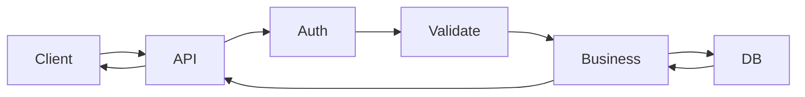

# Backend Development Roadmap

How a **professional** Spring Boot backend is structured, and how this course maps onto that job.

## The job of a backend

A backend:

1. Accepts HTTP requests from clients (web, mobile, other services)
2. Authenticates and authorizes
3. Validates input
4. Runs business rules
5. Reads and writes data
6. Returns a stable JSON contract
7. Logs, metrics, and fails in a controlled way



## Canonical package layout (used from Day 10 onward)

```text
com.course.backend
├── BackendApplication.java
├── config
├── security
├── controller
├── service
├── repository
├── entity
├── dto
│   ├── request
│   └── response
├── mapper
├── exception
└── util
```

| Layer | Allowed | Not allowed |
|---|---|---|
| Controller | HTTP mapping, call service, return DTO | SQL, business rules, entity leaks |
| Service | Use cases, transactions, mapping | `HttpServletRequest`, status codes as logic |
| Repository | Persistence | Validation messages, HTTP |
| Entity | Table mapping | JSON annotations that exist only for the API |
| DTO | API contract + validation annotations | JPA relations |

## Data flow (memorize this)

**Inbound**

```text
HTTP Request
     ↓
DispatcherServlet
     ↓
Security filter chain
     ↓
Controller  (@Valid DTO)
     ↓
Service
     ↓
Repository
     ↓
Hibernate / Mongo template
     ↓
Database
```

**Outbound**

```text
Database
    ↓
Entity
    ↓
Service maps to Response DTO
    ↓
Controller
    ↓
Jackson JSON
    ↓
HTTP Response
```

## Skills vs days

| Backend skill | Days |
|---|---|
| HTTP + JSON + REST design | 1, 8, 9 |
| DI / application architecture | 3, 4, 10 |
| API contracts (DTO, validation, errors) | 11, 12 |
| Relational modeling + ORM | 13–17 |
| Second relational dialect + migrations | 18–20 |
| Document modeling | 21–23 |
| AuthN / AuthZ | 24–26 |
| Automated tests | 27 |
| Observability + docs + config | 28 |
| Repeatable runtime (Docker) | 29 |
| End-to-end product | 30 |

## Interview story you should be able to tell

> “I built a layered Spring Boot API. Controllers talk DTOs. Services own transactions. Repositories are Spring Data. Postgres holds orders; Mongo holds reviews because they are write-heavy and schema-flexible. Auth is stateless JWT. Tests cover services with Mockito and controllers with MockMvc. Schema changes go through Flyway. The app runs in Docker Compose with the database.”

That paragraph is the destination of this roadmap.
