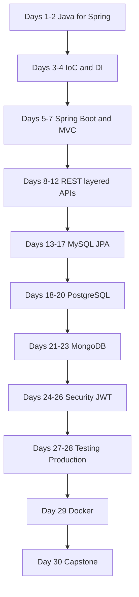

# Learning Roadmap

This is the pedagogical path — **why** the days are ordered this way.

## Phase 1 — Java that Spring needs (Days 1–2)

Spring is “just Java” plus a container that creates objects for you. If interfaces, annotations, and `Optional` are fuzzy, later days collapse.

**Exit criteria:** You can explain why an interface plus a constructor makes a class testable, and why `Optional` appears on `findById`.

## Phase 2 — Spring itself (Days 3–4)

Before Boot, you must understand the **container**. Boot only auto-configures that container.

**Exit criteria:** You can draw constructor injection without annotations, then show the same design with `@Service` / `@Autowired` (constructor, not field).

## Phase 3 — Boot + MVC (Days 5–7)

Now the container starts with one annotation, an embedded Tomcat, and `DispatcherServlet`.

**Exit criteria:** You can create a project from Initializr, explain every generated file, and trace one HTTP request to a controller method.

## Phase 4 — A real API shape (Days 8–12)

REST vocabulary, then an in-memory CRUD, then layers, DTOs, validation, and a global error body.

**Exit criteria:** `POST /api/users` with an invalid email returns `400` with a standard JSON error — no database yet.

## Phase 5 — MySQL + JPA (Days 13–17)

Replace the `List` with a table. Then relationships, N+1, transactions.

**Exit criteria:** User Management API persists to MySQL. You can explain lazy loading and why you do not return entities from controllers.

## Phase 6 — PostgreSQL (Days 18–20)

Not “MySQL with a different URL”. UUID, JSONB, schemas, Flyway.

**Exit criteria:** Employee API on Postgres with a versioned migration, not `ddl-auto=update` in the production profile.

## Phase 7 — MongoDB (Days 21–23)

Documents, embedding vs referencing, aggregation. When **not** to use it.

**Exit criteria:** Blog API with posts, comments, search, pagination.

## Phase 8 — Security (Days 24–26)

Filter chain, password hashing, JWT, roles, CORS.

**Exit criteria:** Register / login / `GET /api/users/me` with a Bearer token. Admin-only endpoints reject `USER`.

## Phase 9 — Production habits (Days 27–29)

Tests, OpenAPI, logs, Actuator, profiles, Docker.

**Exit criteria:** `./mvnw test` is green. Swagger UI shows auth. `docker compose up` runs the app + a database.

## Phase 10 — Capstone (Day 30)

E-Commerce: auth, users, products, categories, cart, orders. Explain it as you would in an interview.

## What not to study yet

This course intentionally skips:

- Kubernetes / service mesh
- Spring Cloud / microservices
- Reactive WebFlux as the default stack
- GraphQL
- Kafka (mentioned only if needed for “what next”)

Master one well-structured monolith API first.
