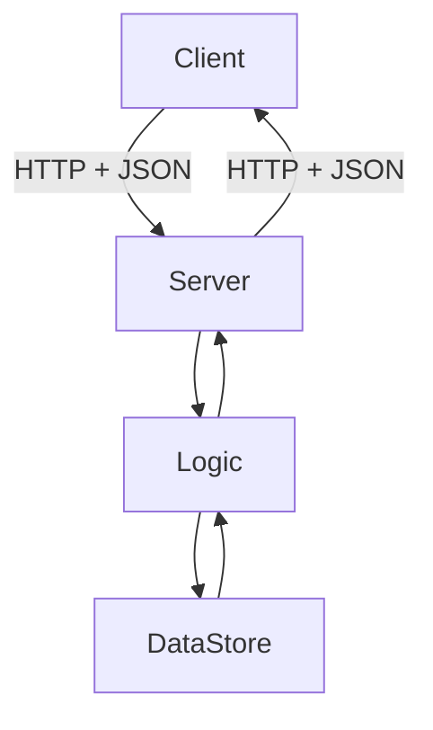

# Day 1 — Backend Fundamentals + Java Refresher

## 🎯 Learning Objectives

By the end of this day you will understand:

- What a backend is, and how it differs from a frontend
- How a client talks to a server over HTTP
- What an API, URL, JSON, and endpoint are
- Which Java tools Spring Boot uses every day: interfaces, collections, exceptions, lambdas, streams
- How to model a tiny in-memory “user store” in plain Java — the same shape you will later wrap with Spring

**Workload:** 1–2 hours reading, 2–3 hours coding.

**Spring Boot knowledge required:** none. We do not start Spring today.

---

# 1. Concept — What is a backend?

## What is it?

A **backend** is the part of a system that:

- lives on a server (or several servers)
- receives requests
- applies business rules
- reads and writes data
- returns a response

The user never talks to your database. The user talks to an **API**. The API talks to the database.

## Why do we need it?

Frontends (React, Angular, mobile apps) cannot be trusted with:

- passwords and payment rules
- database credentials
- “is this user allowed to delete this order?”

Those decisions belong on the server.

## Real-world analogy

A restaurant:

| Restaurant | Software |
|---|---|
| Customer | Client (browser / mobile) |
| Waiter | API / HTTP layer |
| Kitchen | Service / business logic |
| Pantry | Database |

The customer does not walk into the pantry.

## Backend example

When you tap “Place order” in a food app:

```text
Phone  →  HTTPS POST /api/orders  →  Spring Boot  →  PostgreSQL
Phone  ←  JSON { "id": 901, "status": "PLACED" }  ←
```

That HTTP endpoint **is** backend work.

---

# 2. Client vs server

## What is it?

- **Client:** anything that *initiates* a request (browser, Postman, another microservice, a mobile app).
- **Server:** anything that *listens* and *responds* (your Spring Boot process on port 8080).

The same machine can be both. Your laptop running Chrome *and* Spring Boot is a client and a server at once. That confuses beginners. Remember: the **role** is defined by who starts the conversation.

## Why do we need it?

HTTP is a request/response protocol. Someone must send; someone must wait.

## Real-world analogy

You (client) call a pizza shop (server). They do not call you first.

## Backend example

```text
Client:  GET /api/users/5 HTTP/1.1
Server:  200 OK
         { "id": 5, "email": "ada@example.com" }
```

---

# 3. What is an API?

## What is it?

**API** = Application Programming Interface.

In this course it almost always means a **HTTP REST API**: a set of URLs that accept JSON and return JSON.

It is a **contract**:

- If you send this shape of request
- you will get this shape of response
- and this status code if something is wrong

## Why do we need it?

So a React app, an Android app, and a partner company can all use the **same** backend without sharing Java classes.

## Real-world analogy

A power socket. The appliance does not need to know how the power plant works. It needs the socket shape.

## Backend example

```http
GET /api/hello
```

Response:

```json
{ "message": "Hello, backend" }
```

You will build this on Day 9. Today you only need the idea.

---

# 4. HTTP, URL, JSON — the three words you will type daily

## HTTP

**HyperText Transfer Protocol.** A text protocol on top of TCP (or TLS for HTTPS).

A request has:

```text
METHOD  PATH  VERSION
Headers
blank line
optional body
```

Example:

```http
POST /api/users HTTP/1.1
Host: localhost:8080
Content-Type: application/json

{"name":"Ada","email":"ada@example.com"}
```

A response has:

```text
VERSION  STATUS
Headers
blank line
optional body
```

```http
HTTP/1.1 201 Created
Content-Type: application/json

{"id":1,"name":"Ada","email":"ada@example.com"}
```

### Methods you must memorize

| Method | Intent | Body? | Idempotent? |
|---|---|---|---|
| GET | Read | No | Yes |
| POST | Create / trigger | Usually | No |
| PUT | Replace whole resource | Yes | Yes |
| PATCH | Partial update | Yes | Usually |
| DELETE | Remove | Rarely | Yes |

**Idempotent** means repeating the same request leaves the same server state. `DELETE /users/1` twice is still “user 1 is gone”. `POST /users` twice creates two users.

Day 8 goes deeper. Today: GET reads, POST creates.

## URL vs URI vs endpoint

- **URI** — identifier (`/api/users/5`)
- **URL** — URI plus location (`http://localhost:8080/api/users/5`)
- **Endpoint** — one URL + method combination (`GET /api/users/5`)

Path parameter: `/api/users/5` → `5` is the id.  
Query parameter: `/api/users?page=0&size=10` → pagination.

## JSON

**JavaScript Object Notation.** Language-agnostic text for structured data.

```json
{
  "id": 1,
  "name": "Ada",
  "roles": ["USER", "ADMIN"],
  "active": true
}
```

Rules that bite beginners:

- Keys are **double-quoted strings**
- No trailing commas
- `null` is allowed; `undefined` is not JSON
- Numbers are not quoted; strings are

Java talks JSON through **Jackson**, which Spring Boot auto-configures. You will not parse JSON by hand.

---

# 5. How a request flows — even without Spring

```text
Client
  ↓  TCP + HTTP
Listening socket (port 8080)
  ↓
Your Java code
  ↓
Data (today: a List; later: MySQL)
  ↓
JSON bytes back to the client
```

Spring Boot later inserts `DispatcherServlet`, security filters, and JPA. The **shape** does not change.



---

# 6. Java Spring Boot actually uses

You know Java. Below is **why each topic appears in a backend**, not a CS101 recap.

For every topic: definition → why Spring Boot uses it → simple example → Spring-shaped example → common mistake → interview question.

---

## 6.1 Interfaces

### Definition

An interface declares **what** a class can do, not **how**.

### Why Spring Boot / backend developers use it

Spring injects **by type**. You write `UserService` as an interface (or at least depend on an abstraction) so you can:

- swap `InMemoryUserRepository` for `JpaUserRepository` later
- mock the dependency in a unit test

### Simple example

```java
public interface PaymentGateway {
    String charge(int amountCents);
}
```

### Spring Boot-related example

You will later write:

```java
public interface UserRepository extends JpaRepository<User, Long> {
}
```

`JpaRepository` is an **interface**. You never implement it. Spring Data creates a proxy at runtime.

### Common mistake

Creating an interface for every class on Day 1 “because clean code”. One implementation + one class is fine until you have a real second implementation or a test mock.

### Interview question

See Q1 in Easy below.

---

## 6.2 Collections — List, ArrayList, Set, Map, HashMap

### Definition

- `List` — ordered, duplicates allowed
- `Set` — unique elements
- `Map` — key → value

`ArrayList` and `HashMap` are the usual implementations.

### Why Spring Boot uses them

- Controllers return `List<UserResponse>`
- `Map<String, Object>` appears in error bodies
- Repositories return `List<User>`
- In-memory stores (today) are `Map<Long, User>`

### Simple example

```java
List<String> names = new ArrayList<>();
names.add("Ada");
names.add("Ada"); // allowed

Set<String> emails = new HashSet<>();
emails.add("ada@example.com");
emails.add("ada@example.com"); // ignored

Map<Long, String> idToEmail = new HashMap<>();
idToEmail.put(1L, "ada@example.com");
```

### Spring Boot-related example

```java
@GetMapping("/api/users")
public List<User> findAll() {
    return new ArrayList<>(users.values());
}
```

(You will not put this in a controller after Day 10. Today it is legal.)

### Common mistake

Returning the live internal `ArrayList` from a service. The controller (or a caller) can then `clear()` your database. Return a copy, or later, an unmodifiable list / DTO list.

### Interview question

Difference between `List` and `Set`? See Medium Q1.

---

## 6.3 Exception handling — checked vs unchecked

### Definition

- **Checked** (`IOException`, `SQLException`): compiler forces `throws` or `try/catch`.
- **Unchecked** (`RuntimeException` and subclasses): not forced.

### Why Spring Boot uses it

Modern Spring APIs almost never throw checked exceptions. You will create:

```java
public class ResourceNotFoundException extends RuntimeException {
    public ResourceNotFoundException(String message) {
        super(message);
    }
}
```

A `@RestControllerAdvice` turns it into HTTP 404. That is Day 12. Today you need to know **why** it is a `RuntimeException`: so service methods stay clean.

### Simple example

```java
void parseAge(String raw) {
    try {
        int age = Integer.parseInt(raw);
    } catch (NumberFormatException ex) {
        throw new IllegalArgumentException("age must be a number", ex);
    }
}
```

### Spring Boot-related example

```java
public User findById(Long id) {
    User user = store.get(id);
    if (user == null) {
        throw new ResourceNotFoundException("User " + id + " not found");
    }
    return user;
}
```

Do **not** return `null` from a service and hope the controller remembers to check.

### Common mistake

Catching `Exception` and swallowing it:

```java
} catch (Exception e) {
    // TODO
}
```

The API then returns 200 with empty data. Nightmares in production.

### Interview question

Why are Spring’s `DataAccessException`s unchecked? See Hard Q1.

---

## 6.4 Lambdas and functional interfaces

### Definition

A **functional interface** has one abstract method. A **lambda** is a compact implementation of that method.

```java
@FunctionalInterface
public interface Predicate<T> {
    boolean test(T t);
}
```

### Why Spring Boot uses them

- Stream pipelines when mapping entities → DTOs
- `Optional.map(...)`
- `Runnable` / callbacks in rare cases
- Spring Security matchers: `request.auth.requestMatchers("/api/public/**").permitAll()`

### Simple example

```java
Predicate<Integer> adult = age -> age >= 18;
```

### Spring Boot-related example

```java
List<String> emails = users.stream()
        .filter(u -> u.active())
        .map(User::email)
        .toList();
```

### Common mistake

Writing 40-line lambdas. If it needs a name, it needs a method.

---

## 6.5 Streams

### Definition

A pipeline over a collection: `source → intermediate ops → terminal op`.

### Why Spring Boot uses them

Mapping, filtering, grouping for API responses. Not a replacement for SQL. **Do not** `findAll()` 2 million rows and stream-filter in Java if the database can `WHERE`.

### Simple example

```java
List<Integer> evens = List.of(1, 2, 3, 4).stream()
        .filter(n -> n % 2 == 0)
        .toList();
```

### Spring Boot-related example

```java
public List<UserResponse> findActive() {
    return users.values().stream()
            .filter(User::active)
            .map(u -> new UserResponse(u.id(), u.name(), u.email()))
            .toList();
}
```

### Common mistake

Using `.stream().forEach(...)` when a for-loop is clearer. Streams shine for **transform**, not **side effects**.

---

# 7. Write this on your machine (file by file)

This is the **same design** you will put behind HTTP on Day 9. No Spring.

Do **not** copy the whole folder. Create each file yourself. The finished reference (if you get stuck) is:

```text
java-springboot-backend/practical/day-01/src/com/course/day01/
```

### Step 0 — Create the project on your laptop

```bash
mkdir -p ~/springboot-practice/day-01/src/com/course/day01
cd ~/springboot-practice/day-01
```

Open that folder in IntelliJ or VS Code. You will add **six files**, in this order.

| # | File | Why it exists |
|---|---|---|
| 1 | `User.java` | The data you store (later: a table row / DTO) |
| 2 | `UserNotFoundException.java` | Domain error (later: HTTP 404) |
| 3 | `UserRepository.java` | Persistence contract — service must not know about `HashMap` |
| 4 | `InMemoryUserRepository.java` | Today's "database" |
| 5 | `UserService.java` | Business rules + constructor injection |
| 6 | `Day01App.java` | `main` instead of Tomcat — wires objects by hand |

### How to compile and run (after all six files exist)

```bash
cd ~/springboot-practice/day-01
javac -d out src/com/course/day01/*.java
java -cp out com.course.day01.Day01App
```

Expected output includes `Created:`, `Found:`, `Expected duplicate:`, `Expected missing:`.

---

# 7.1 File 1 — `User.java`

**Path on your machine:** `src/com/course/day01/User.java`

Type this file first. A record is an immutable data carrier — later you will use the same idea for JSON DTOs.

```java
package com.course.day01;

/**
 * A user in memory. Records give us constructor, getters,
 * equals, hashCode, and toString automatically.
 *
 * Why a record for Spring Boot later?
 * Request/response DTOs are immutable data carriers.
 * Records fit that job. JPA entities usually remain classes
 * because Hibernate needs a no-arg constructor and mutable fields.
 */
public record User(Long id, String name, String email, boolean active) {

    public User {
        if (name == null || name.isBlank()) {
            throw new IllegalArgumentException("name is required");
        }
        if (email == null || !email.contains("@")) {
            throw new IllegalArgumentException("email is invalid");
        }
    }

    public User withId(Long newId) {
        return new User(newId, name, email, active);
    }
}
```

**Line by line**

- `record User(...)` — compact immutable class.
- Compact constructor `public User { ... }` — validation before the object exists.
- `withId` — records have no setters. “Change” means “return a copy”. This is how you assign an id after insert.

**Save the file. Do not run yet.**

---

# 7.2 File 2 — `UserNotFoundException.java`

**Path:** `src/com/course/day01/UserNotFoundException.java`

```java
package com.course.day01;

public class UserNotFoundException extends RuntimeException {
    public UserNotFoundException(Long id) {
        super("User " + id + " not found");
    }
}
```

Unchecked, so `UserService` methods do not declare `throws`.

---

# 7.3 File 3 — `UserRepository.java` (interface)

**Path:** `src/com/course/day01/UserRepository.java`

```java
package com.course.day01;

import java.util.List;
import java.util.Optional;

public interface UserRepository {

    User save(User user);

    Optional<User> findById(Long id);

    List<User> findAll();

    void deleteById(Long id);

    boolean existsByEmail(String email);
}
```

**Why `Optional`?** Absence is not an error yet. The **service** decides whether missing means 404.

Spring Data’s `JpaRepository.findById` returns `Optional` for the same reason.

---

# 7.4 File 4 — `InMemoryUserRepository.java`

**Path:** `src/com/course/day01/InMemoryUserRepository.java`

```java
package com.course.day01;

import java.util.ArrayList;
import java.util.HashMap;
import java.util.List;
import java.util.Map;
import java.util.Optional;
import java.util.concurrent.atomic.AtomicLong;

public class InMemoryUserRepository implements UserRepository {

    private final Map<Long, User> store = new HashMap<>();
    private final AtomicLong sequence = new AtomicLong(1);

    @Override
    public User save(User user) {
        if (user.id() == null) {
            long id = sequence.getAndIncrement();
            User created = user.withId(id);
            store.put(id, created);
            return created;
        }
        store.put(user.id(), user);
        return user;
    }

    @Override
    public Optional<User> findById(Long id) {
        return Optional.ofNullable(store.get(id));
    }

    @Override
    public List<User> findAll() {
        return new ArrayList<>(store.values());
    }

    @Override
    public void deleteById(Long id) {
        store.remove(id);
    }

    @Override
    public boolean existsByEmail(String email) {
        return store.values().stream()
                .anyMatch(u -> u.email().equalsIgnoreCase(email));
    }
}
```

**Line by line**

- `Map<Long, User>` — primary key lookup, O(1). This is your “table”.
- `AtomicLong` — id generator. The database will do this later (`@GeneratedValue`).
- `save` with `id == null` → insert; otherwise update. Spring Data JPA `save` behaves the same way.
- `findAll` copies values so callers cannot mutate the map.
- `existsByEmail` uses a stream. In SQL this becomes `SELECT COUNT(*) ... WHERE email = ?`.

---

# 7.5 File 5 — `UserService.java` (business rules live here)

**Path:** `src/com/course/day01/UserService.java`

```java
package com.course.day01;

import java.util.List;

public class UserService {

    private final UserRepository users;

    public UserService(UserRepository users) {
        this.users = users;
    }

    public User create(String name, String email) {
        if (users.existsByEmail(email)) {
            throw new IllegalStateException("Email already registered: " + email);
        }
        return users.save(new User(null, name, email, true));
    }

    public User getById(Long id) {
        return users.findById(id)
                .orElseThrow(() -> new UserNotFoundException(id));
    }

    public List<User> listActive() {
        return users.findAll().stream()
                .filter(User::active)
                .toList();
    }

    public void delete(Long id) {
        getById(id);
        users.deleteById(id);
    }
}
```

**This is dependency injection without Spring.**

- The service does **not** call `new InMemoryUserRepository()`.
- The repository is passed into the constructor.
- Tomorrow you could pass a fake repository in a unit test.
- On Day 4, Spring will call this constructor for you.

**Request flow (even without HTTP)**

```text
Caller
  ↓ create("Ada", "ada@example.com")
UserService  (checks duplicate email)
  ↓ save
UserRepository
  ↓ put
HashMap
```

## 7.6 `Day01App.java` — a tiny “main” instead of Tomcat

```java
package com.course.day01;

public class Day01App {

    public static void main(String[] args) {
        UserRepository repository = new InMemoryUserRepository();
        UserService service = new UserService(repository);

        User ada = service.create("Ada", "ada@example.com");
        System.out.println("Created: " + ada);

        User found = service.getById(ada.id());
        System.out.println("Found: " + found);

        System.out.println("Active users: " + service.listActive());

        try {
            service.create("Ada 2", "ada@example.com");
        } catch (IllegalStateException ex) {
            System.out.println("Expected duplicate: " + ex.getMessage());
        }

        try {
            service.getById(999L);
        } catch (UserNotFoundException ex) {
            System.out.println("Expected missing: " + ex.getMessage());
        }
    }
}
```

**What Spring will later replace**

| Today | Later |
|---|---|
| `main` wires objects | Spring container |
| `System.out` | HTTP JSON |
| `HashMap` | MySQL / Postgres |
| `IllegalStateException` | HTTP 409 via `@RestControllerAdvice` |

Run it. You should see a created user, a found user, a duplicate error, and a not-found error.

---

# 8. Common Mistakes

1. **Thinking the backend is “the database”.** The backend is the process that *uses* the database.
2. **Returning `null` from `findById`.** Use `Optional` at the repository; throw in the service if the use case requires the entity.
3. **Putting duplicate-email checks in `main` / later in the controller.** That is a business rule → service.
4. **Using `LinkedList` for everything.** Default list is `ArrayList`. Default map is `HashMap`.
5. **Checked exceptions on every method.** You will fight Spring’s proxy and your own sanity. Prefer unchecked domain exceptions.
6. **Confusing JSON objects with Java Maps always.** Prefer typed classes / records. `Map<String, Object>` is for truly dynamic payloads.

---

# 9. Practical Exercise

Type the six classes above. Then add:

1. `User updateEmail(Long id, String newEmail)` in `UserService`. Reject if the new email belongs to another user.
2. `List<User> searchByName(String fragment)` using streams and `toLowerCase()`.
3. Write a second `UserRepository` implementation named `FakeUserRepository` that stores users in an `ArrayList` instead of a `HashMap`. Swap it in `main` without changing `UserService`. That is the point of the interface.

---

# 10. Mini Project — CLI User Manager

Build a loop in `main`:

```text
1) create
2) list
3) get by id
4) delete
5) exit
```

Read from `Scanner`. Print JSON-like lines. No Spring, no Maven required — a single IntelliJ scratch project is enough.

Success looks like:

```text
> 1
name: Grace
email: grace@example.com
{"id":1,"name":"Grace","email":"grace@example.com","active":true}
> 3
id: 1
{"id":1,"name":"Grace","email":"grace@example.com","active":true}
> 3
id: 42
ERROR User 42 not found
```

---

# 11. Interview Questions

## Easy

### Q1. What is an API?

**Difficulty:** Easy

**Answer:**

An API is a contract that lets one program use another without knowing its internals. In backend work it usually means HTTP endpoints that accept and return JSON.

**Simple Explanation:**

A menu of operations the server promises to support.

**Example:**

```http
GET /api/users/1
```

**Interview Tip:**

Say “contract” and mention status codes, not only URLs.

**Common Follow-up Question:**

What is the difference between an API and a REST API?

---

### Q2. What is the difference between a client and a server?

**Difficulty:** Easy

**Answer:**

The client initiates the request. The server listens, processes, and responds. Roles can reverse in other protocols, but for HTTP this is the definition.

**Simple Explanation:**

Who dials the phone vs who picks up.

**Example:**

Postman is the client; Spring Boot on port 8080 is the server.

**Interview Tip:**

Do not say “the server is the database”.

**Common Follow-up Question:**

Can a Spring Boot app be a client? (Yes — it can call other HTTP APIs with `RestClient`.)

---

### Q3. What is JSON?

**Difficulty:** Easy

**Answer:**

A text format for structured data: objects, arrays, strings, numbers, booleans, null. Language independent. Spring uses Jackson to convert Java objects to JSON and back.

**Simple Explanation:**

The envelope your API speaks.

**Example:**

```json
{ "id": 1, "email": "ada@example.com" }
```

**Interview Tip:**

Mention `Content-Type: application/json`.

**Common Follow-up Question:**

JSON vs XML for APIs?

---

### Q4. What is HTTP GET used for?

**Difficulty:** Easy

**Answer:**

Safe, idempotent reads. No request body in normal REST usage. Must not change server state (beyond logs/cache).

**Simple Explanation:**

“Show me this resource.”

**Example:**

```http
GET /api/users/5
```

**Interview Tip:**

GET with a body is non-standard; do not design APIs that way.

**Common Follow-up Question:**

Difference between path and query parameters?

---

### Q5. What is a Java interface?

**Difficulty:** Easy

**Answer:**

A type that declares methods without implementing them (default/static methods aside). Classes `implement` it. Spring frequently injects interface types.

**Simple Explanation:**

A promise of behavior.

**Example:**

```java
public interface UserRepository {
    Optional<User> findById(Long id);
}
```

**Interview Tip:**

Connect interfaces to testing and swapping implementations.

**Common Follow-up Question:**

Interface vs abstract class?

---

## Medium

### Q1. List vs Set vs Map — when does a backend use each?

**Difficulty:** Medium

**Answer:**

- `List`: ordered results (`findAll`, page content).
- `Set`: uniqueness (`roles`, distinct ids).
- `Map`: lookups and flexible JSON (`field → error message`).

**Simple Explanation:**

Sequence, unique bag, dictionary.

**Example:**

```java
Map<String, String> errors = Map.of("email", "must be a well-formed email address");
```

**Interview Tip:**

Mention `HashMap` vs `LinkedHashMap` if order of keys in JSON matters.

**Common Follow-up Question:**

Is `HashMap` thread-safe? (`ConcurrentHashMap` / immutability for shared state.)

---

### Q2. Why does `Optional` appear on `findById`?

**Difficulty:** Medium

**Answer:**

Because “no row” is a normal outcome, not necessarily a failure. `Optional` forces the caller to choose: `orElseThrow`, `orElse`, `map`. Returning `null` is easy to forget.

**Simple Explanation:**

A box that might be empty.

**Example:**

```java
return users.findById(id).orElseThrow(() -> new UserNotFoundException(id));
```

**Interview Tip:**

Never return `Optional` from a REST controller as the JSON type — unwrap it.

**Common Follow-up Question:**

Should `Optional` be used as a field on an entity? (Generally no.)

---

### Q3. Checked vs unchecked exceptions in API code.

**Difficulty:** Medium

**Answer:**

Checked exceptions must be declared or caught. They clutter service APIs and interact badly with Spring proxies and lambdas. Domain errors in Spring apps are usually `RuntimeException` subclasses mapped to HTTP by `@RestControllerAdvice`.

**Simple Explanation:**

Compiler-forced vs not.

**Example:**

```java
public class ConflictException extends RuntimeException {
    public ConflictException(String message) { super(message); }
}
```

**Interview Tip:**

Do not claim checked exceptions are “bad”. They are the wrong default for web apps.

**Common Follow-up Question:**

How do you wrap `SQLException`? (Spring already translates it to `DataAccessException`.)

---

### Q4. Why inject a repository into a service instead of `new`?

**Difficulty:** Medium

**Answer:**

`new` hard-wires the implementation. Constructor injection lets tests pass a fake, and later lets Spring swap in a JPA repository without changing the service.

**Simple Explanation:**

Don’t build your own engine inside the car class.

**Example:**

See `UserService` above.

**Interview Tip:**

This is the seed of Dependency Injection. Name it.

**Common Follow-up Question:**

What is tight coupling?

---

### Q5. When should you not use Java Streams?

**Difficulty:** Medium

**Answer:**

When the database can filter cheaper; when the lambda has side effects; when a simple loop is more readable; when you already have an indexed SQL query.

**Simple Explanation:**

Streams are in-memory pipelines, not a query planner.

**Example:**

Bad: `userRepository.findAll().stream().filter(u -> u.email().equals(email))`.  
Good: `userRepository.findByEmail(email)`.

**Interview Tip:**

Interviewers love this because it shows you will not load a whole table.

**Common Follow-up Question:**

What does `findAll` do in JPA? (Selects every row.)

---

## Hard

### Q1. Why did Spring make data-access exceptions unchecked?

**Difficulty:** Hard

**Why?** JDBC’s `SQLException` is checked and leaks JDBC into every layer.

**How?** Spring translates vendor exceptions into a hierarchy under `DataAccessException` (`RuntimeException`).

**When?** Always, if you use Spring templates / Spring Data.

**Trade-offs:** You can forget to handle a failure — so you handle it at the API boundary, not on every line.

**Real-world example:** A unique constraint violation becomes `DataIntegrityViolationException`, which your advice can map to HTTP 409.

**Answer:**

Spring’s data access exception model exists so services are not glued to JDBC. Unchecked exceptions let the exception bubble to a global handler.

**Simple Explanation:**

Don’t force every method to `throws SQLException`.

**Example:**

```java
try {
    users.save(user);
} catch (DataIntegrityViolationException ex) {
    throw new ConflictException("Email already exists");
}
```

**Interview Tip:**

Name `PersistenceExceptionTranslationPostProcessor` only if you know it; “Spring translates JDBC exceptions” is enough.

**Common Follow-up Question:**

Difference between `DataIntegrityViolationException` and `DuplicateKeyException`.

---

### Q2. Design an in-memory store that will later be replaced by JPA without rewriting services.

**Difficulty:** Hard

**Why?** You may not have a database on Day 1 of a spike.

**How?** Repository interface + POJO/record that resembles an entity + service that never touches `Map`.

**When?** Prototypes, tests, tutorials (this course).

**Trade-offs:** Your in-memory semantics (`save` with null id) must match JPA or the swap will break.

**Real-world example:** Today’s `UserRepository`. Day 15 replaces the implementation; `UserService` stays.

**Answer:**

Depend on an interface whose methods match Spring Data (`save`, `findById` → `Optional`, `findAll`, `deleteById`). Keep ids explicit. Do not leak `HashMap` types.

**Simple Explanation:**

Program to the interface you wish Spring Data already gave you.

**Example:**

The code in section 7.

**Interview Tip:**

Mention that tests can keep using the in-memory impl.

**Common Follow-up Question:**

How do you handle pagination without a database? (`subList` — and know it is not the same as SQL `LIMIT`.)

---

### Q3. Your API must reject duplicate emails. Where does that rule live, and why not in the controller or the map?

**Difficulty:** Hard

**Why?** Controllers change with HTTP; maps change with storage; the rule is the business.

**How?** Service checks `existsByEmail` then `save`. Later the database unique constraint is the last line of defense.

**When?** Always for uniqueness that users can trigger.

**Trade-offs:** Check-then-insert is racy under concurrency. Production adds a unique index and handles the constraint violation.

**Real-world example:** Two parallel `POST /api/users` with the same email.

**Answer:**

Put the rule in the service, enforce it in the database too. The in-memory `existsByEmail` is not enough under load.

**Simple Explanation:**

Business rule + database constraint, not UI, not HashMap.

**Example:**

```java
if (users.existsByEmail(email)) {
    throw new IllegalStateException("Email already registered");
}
```

**Interview Tip:**

Saying “unique index” in a junior interview stands out.

**Common Follow-up Question:**

HTTP status for duplicate email? (409 Conflict, sometimes 400. Pick one and be consistent.)

---

### Q4. Explain tight coupling using today’s `UserService` if it called `new InMemoryUserRepository()`.

**Difficulty:** Hard

**Answer:**

The service would compile against a concrete class. You could not test it without a real map, nor replace the map with JPA, without editing the service. That is tight coupling: a change in persistence forces a change in business logic.

**Simple Explanation:**

The kitchen owns a specific brand of fridge glued to the floor.

**Example:**

```java
// tightly coupled — do not do this
private final UserRepository users = new InMemoryUserRepository();
```

**Interview Tip:**

Follow with “constructor injection fixes this”.

**Common Follow-up Question:**

Is depending on `UserRepository` still coupling? (Yes, to an abstraction — that is the point.)

---

### Q5. Walk through what happens if `getById` is called with a missing id, from caller to exception type.

**Difficulty:** Hard

**Why / How / When / Trade-offs / Real-world:** This is the 404 path you will expose over HTTP.

**Answer:**

1. Caller invokes `service.getById(999)`.
2. Service calls `users.findById(999)`.
3. Repository does `store.get(999)` → `null`.
4. `Optional.ofNullable(null)` → empty.
5. `orElseThrow` creates `UserNotFoundException`.
6. Stack unwinds. Nobody returns `null`.
7. Later, a global handler maps that type to `{ "status": 404, ... }`.

**Simple Explanation:**

Empty optional becomes a typed exception, not a null pointer.

**Example:**

See `UserService.getById`.

**Interview Tip:**

Draw it. Interviewers love a flow.

**Common Follow-up Question:**

Should the repository throw instead of returning `Optional`? (No — repositories report data; services interpret it.)

---

# 12. Day-End Practice

Tasks:

1. Write `User`, `UserRepository`, `InMemoryUserRepository`, `UserService` from memory.
2. Explain out loud what JSON is to an imaginary intern.
3. List five HTTP methods and one sentence each.
4. Convert a `for` loop that filters active users into a stream.
5. Break your code on purpose: pass a name of `""` and read the stack trace.

---

# 13. Quick Revision

- Backend = server-side rules + data; not the database itself.
- Client asks, server answers, HTTP carries the conversation, JSON is the payload.
- `GET` reads, `POST` creates.
- Interfaces let you swap `HashMap` for MySQL later.
- Repositories return `Optional`; services throw domain exceptions.
- Constructor injection exists before Spring. Spring only automates it.
- Streams map/filter in memory; SQL filters in the database.

---

# 14. What You Should Be Able To Explain

By the end of today, you should be able to explain:

- What a backend API is
- Client vs server
- HTTP request vs response
- JSON as an API contract
- Why `UserService` does not call `new InMemoryUserRepository()`
- Why `findById` returns `Optional`
- List vs Map for an in-memory store
- Checked vs unchecked exceptions in web apps

**Tomorrow:** more Java that Spring depends on — OOP, annotations, generics, records, immutability, `equals`/`hashCode`.

**Next:** [Day 2](../day-02-java-for-springboot/README.md)
