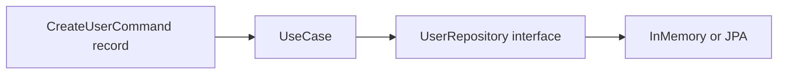

# Day 2 — Java Concepts Spring Boot Actually Uses

## 🎯 Learning Objectives

By the end of this day you will understand:

- OOP building blocks as they appear in Spring: classes, constructors, encapsulation, inheritance, polymorphism
- Abstract classes vs interfaces (and why Spring prefers interfaces)
- Access modifiers, `static`, `final`, immutability
- Annotations as metadata — the mechanism Spring is built on
- Generics, `Optional`, records, enums
- `equals`, `hashCode`, `toString` and why JPA entities are dangerous if you get these wrong
- Java Date/Time API for `createdAt` fields

**Prerequisite:** Day 1 in-memory `UserService`.

---

# 1. Concept — Spring is Java with a container

## What is it?

Spring does not invent a new language. It **creates your objects**, **injects dependencies**, and **reads annotations**.

If constructors, interfaces, and annotations are shaky, Boot looks like magic. It is not magic.

## Why do we need it?

Every `@Service` class is a normal class. Every `@GetMapping` method is a normal method. The container decides *when* to call them.

## Real-world analogy

A theatre. Actors (your classes) already know their lines. The director (Spring) decides who walks on stage and who they talk to.

## Backend example

```java
@Service
public class OrderService {
    private final PaymentClient payments;

    public OrderService(PaymentClient payments) {
        this.payments = payments;
    }
}
```

This is a class, a constructor, an interface-typed field, and one annotation. That is the whole trick.

---

# 2. Classes, objects, constructors, encapsulation

## What is it?

- **Class** — blueprint
- **Object** — instance
- **Constructor** — how the instance is born
- **Encapsulation** — hide fields, expose behavior

## Why Spring Boot uses it

Spring calls **one constructor** to create a bean. If you have two constructors and do not mark one with `@Autowired`, Boot 2.x failed; Boot 3 still prefers a single constructor.

Immutable fields (`private final`) plus constructor assignment are the default style.

## Simple example

```java
public class Email {
    private final String value;

    public Email(String value) {
        if (value == null || !value.contains("@")) {
            throw new IllegalArgumentException("invalid email");
        }
        this.value = value;
    }

    public String value() {
        return value;
    }
}
```

## Spring Boot-related example

```java
@Service
public class UserService {
    private final UserRepository users;

    public UserService(UserRepository users) {
        this.users = users;
    }
}
```

No setter. No field injection. The object cannot exist in a half-wired state.

## Common mistake

A class with a default constructor plus setters for every dependency. You can call `new UserService()` and forget `setUserRepository`. Then `NullPointerException` in production.

## Interview question

Why is constructor injection safer than setters? Day 4 covers this; the Java reason is: `final` fields.

---

# 3. Inheritance, abstract classes, polymorphism

## What is it?

- **Inheritance** — `extends` a class, reuse implementation
- **Abstract class** — cannot be instantiated; may have fields and concrete methods
- **Polymorphism** — a variable of a parent/interface type holds a child instance

## Why Spring Boot uses it

Spring MVC: `OncePerRequestFilter extends GenericFilterBean`.  
Your code: `ResourceNotFoundException extends RuntimeException`.  
You rarely `extend` a service class. You **implement** interfaces.

Framework authors use abstract classes for “template method”. Application authors use interfaces for ports.

## Simple example

```java
public abstract class Money {
    private final long cents;

    protected Money(long cents) {
        this.cents = cents;
    }

    public long cents() {
        return cents;
    }
}

public class Usd extends Money {
    public Usd(long cents) {
        super(cents);
    }
}
```

## Spring Boot-related example

```java
public abstract class ApiException extends RuntimeException {
    private final int status;

    protected ApiException(int status, String message) {
        super(message);
        this.status = status;
    }

    public int status() {
        return status;
    }
}

public class NotFoundException extends ApiException {
    public NotFoundException(String message) {
        super(404, message);
    }
}
```

`@RestControllerAdvice` can catch `ApiException` and read `status()`. Polymorphism.

## Common mistake

Deep inheritance trees for services (`BaseService<T>` 6 levels down). Prefer composition.

---

# 4. Access modifiers

| Modifier | Class | Package | Subclass | World |
|---|---|---|---|---|
| `private` | yes | | | |
| (package) | yes | yes | | |
| `protected` | yes | yes | yes | |
| `public` | yes | yes | yes | yes |

## Why Spring Boot uses it

- Beans and controller methods that handle HTTP must be **public** (Spring’s proxy and reflective invocation).
- Fields should stay **private**.
- Package-private is excellent for tests in the same package.

JPA entities: private fields + public getters/setters (or protected) because Hibernate subclasses your entity.

## Common mistake

`public` fields on entities. Anyone can assign `user.id = null`.

---

# 5. `static`, `final`, immutability

## What is it?

- `static` — belongs to the type, not an instance
- `final` class — cannot extend
- `final` method — cannot override
- `final` field — assigned once
- **Immutable object** — state never changes after construction

## Why Spring Boot uses it

- `private final` dependencies
- Immutable DTOs / records
- `static` logger: `private static final Logger log = LoggerFactory.getLogger(X.class);`
- **Never** put request state in `static` fields — that is shared across all HTTP requests (all users)

## Simple example

```java
public final class Isbn {
    private final String value;

    public Isbn(String value) {
        this.value = value;
    }
}
```

## Spring Boot-related example — the bug

```java
@RestController
public class CartController {
    // WRONG: one cart for the entire JVM
    private static final List<Item> CART = new ArrayList<>();
}
```

One user’s add-to-cart appears in another user’s cart. State belongs in a database or in the session, not in `static`.

## Common mistake

`static` service locators (`AppContext.getBean`) instead of injection.

---

# 6. Annotations — Java’s metadata, Spring’s control panel

## What is it?

An annotation is extra information on a class, method, field, or parameter. The compiler or a runtime library reads it.

You can write your own:

```java
@Retention(RetentionPolicy.RUNTIME)
@Target(ElementType.TYPE)
public @interface Audited {
    String value() default "";
}
```

- `@Retention(RUNTIME)` — still there when the app runs (Spring needs this)
- `@Target(TYPE)` — only on classes

## Why Spring Boot uses it

Almost every Spring feature is “find types with annotation X, do Y”:

| Annotation | Spring does |
|---|---|
| `@Component` | register a bean |
| `@GetMapping` | bind HTTP GET |
| `@Transactional` | wrap method in a transaction proxy |
| `@Entity` | map a table (JPA, not Spring itself) |

## Simple example

```java
@Deprecated
public void oldMethod() {}
```

The compiler reads `@Deprecated`. No runtime container involved.

## Spring Boot-related example

```java
@RestController
@RequestMapping("/api/users")
public class UserController {
    @GetMapping("/{id}")
    public UserResponse get(@PathVariable Long id) {
        return service.get(id);
    }
}
```

**What happens internally (high level):**

1. `@SpringBootApplication` turns on component scanning.
2. Spring finds `UserController` because `@RestController` includes `@Controller` includes `@Component`.
3. It creates one instance (a bean).
4. `RequestMappingHandlerMapping` reads `@GetMapping("/{id}")` and stores “GET `/api/users/{id}` → this method”.
5. A request arrives. DispatcherServlet looks up the mapping and invokes the method via reflection.

You did not write a servlet. You wrote metadata.

## Common mistake

Putting `@Autowired` on a field and a constructor. Pick constructor only.

## Confused annotations (preview; Day 6 goes deep)

| Pair | Difference |
|---|---|
| `@Controller` vs `@RestController` | View name vs JSON body |
| `@Component` vs `@Bean` | Class-level scan vs factory method |
| `@Service` vs `@Repository` | Same scan; `@Repository` also translates persistence exceptions |

---

# 7. Generics

## What is it?

A type parameter. `List<User>` not raw `List`.

## Why Spring Boot uses it

```java
public interface UserRepository extends JpaRepository<User, Long> {}
```

- `User` — entity type
- `Long` — id type

`Optional<User>`, `ResponseEntity<UserResponse>`, `Page<Product>`.

## Simple example

```java
public class Box<T> {
    private final T value;
    public Box(T value) { this.value = value; }
    public T value() { return value; }
}
```

## Spring Boot-related example

```java
public interface CrudService<T, ID> {
    T get(ID id);
}
```

Use sparingly. One generic `CrudService` often fights real business rules.

## Common mistake

Raw types: `List users = new ArrayList();` — you lose compile-time safety and get warnings.

---

# 8. Optional (again, because interviews love it)

Rules for this course:

| Location | Use Optional? |
|---|---|
| Repository `find*` that may miss | Yes |
| Service method that must have the entity | No — return `T` or throw |
| Controller return type | No |
| Entity field | No |
| Collection | No — empty list, not `Optional<List>` |

```java
public User get(Long id) {
    return repository.findById(id)
            .orElseThrow(() -> new UserNotFoundException(id));
}
```

Never:

```java
optional.get(); // NoSuchElementException if empty
```

Use `orElseThrow`.

---

# 9. Enums

## What is it?

A fixed set of named instances.

```java
public enum OrderStatus {
    PENDING, PAID, SHIPPED, CANCELLED
}
```

## Why Spring Boot uses it

- JPA `@Enumerated(EnumType.STRING)` — store `"PAID"` not `1` (ordinal breaks when you insert a new value)
- Security roles: `Role.ADMIN`
- JSON: Jackson serializes the name

## Common mistake

```java
@Enumerated(EnumType.ORDINAL)
```

You add `REFUNDED` in the middle of the enum. Old rows now mean the wrong status. Always **STRING** unless you have a documented integer code column.

---

# 10. Records vs classes for DTOs

```java
public record UserResponse(Long id, String name, String email) {}
```

| | Record | Class |
|---|---|---|
| Immutability | Default | You must write it |
| JPA entity | Poor fit | Standard |
| JSON DTO | Excellent | Also fine |
| Inheritance | Cannot extend a record | Can |

**This is simplified for learning; production code may require additional considerations** such as Jackson annotations for renaming (`@JsonProperty`).

---

# 11. `equals`, `hashCode`, `toString`

## Why Spring Boot / JPA care

`HashMap` and `HashSet` use `equals`/`hashCode`. JPA entities in a `Set` on a `@ManyToMany` will break if `equals` uses a mutable field or a `null` id.

**Practical rule for JPA (Day 16):**

- Do not include lazy collections in `equals`/`hashCode`/`toString` (that can load the whole database while logging).
- Prefer equality on business key (email) or on id **after** it is assigned, consistently.

Lombok `@Data` on an entity is a famous foot-gun because it includes every field.

## Simple example

```java
@Override
public boolean equals(Object o) {
    if (this == o) return true;
    if (!(o instanceof User user)) return false;
    return Objects.equals(id, user.id);
}

@Override
public int hashCode() {
    return Objects.hashCode(id);
}
```

Records already implement these on all components — another reason they are good DTOs and awkward entities.

---

# 12. Java Date/Time API

Use `java.time`, not `java.util.Date`.

| Type | Use |
|---|---|
| `Instant` | timestamp in UTC (createdAt in APIs) |
| `LocalDate` | birthday, business date without time |
| `LocalDateTime` | local date-time without zone (be careful) |
| `OffsetDateTime` | date-time with offset, good for APIs |
| `Duration` / `Period` | amounts of time |

```java
public record Audit(Instant createdAt) {
    public static Audit now() {
        return new Audit(Instant.now());
    }
}
```

Jackson + Spring Boot 3 serializes `Instant` as ISO-8601 by default:

```json
"createdAt": "2026-09-20T12:00:00Z"
```

**Do not** use `LocalDateTime.now()` for events that must be comparable across time zones.

---

# 13. How It Works — putting the Java together

A production-shaped class using only Java (no Spring yet):

```java
public final class CreateUserUseCase {
    private final UserRepository users;

    public CreateUserUseCase(UserRepository users) {
        this.users = users;
    }

    public User execute(CreateUserCommand command) {
        if (users.existsByEmail(command.email())) {
            throw new DuplicateEmailException(command.email());
        }
        User user = new User(null, command.name(), command.email(), true);
        return users.save(user);
    }
}

public record CreateUserCommand(String name, String email) {}

public enum Role { USER, ADMIN }
```

Spring later adds `@Service` on the use case and `@Valid` on the command. The Java design does not change.



---

# 14. Write this on your machine (file by file)

Do **not** copy the whole folder. Create each file yourself. Finished reference:

```text
java-springboot-backend/practical/day-02/src/com/course/day02/
```

### Step 0 — Create the project on your laptop

```bash
mkdir -p ~/springboot-practice/day-02/src/com/course/day02
cd ~/springboot-practice/day-02
```

| # | File | Why it exists |
|---|---|---|
| 1 | `UseCase.java` | Custom runtime annotation — this is how Spring-style metadata works |
| 2 | `Email.java` | Immutable value object, safe as a `HashMap` key |
| 3 | `Product.java` | Entity-style class with careful `equals`/`hashCode` and `Instant` |
| 4 | `RegisterUserUseCase.java` | Annotated use case using `Email` as a map key |
| 5 | `Day02App.java` | Discovers the annotation and proves HashSet + canonical email |

```bash
javac -d out src/com/course/day02/*.java
java -cp out com.course.day02.Day02App
```

---

# 14. Code Example — annotations, generics, equals, time

Type the files below into the paths in the table.

## 14.1 File 1 — `UseCase.java` (custom annotation)

**Path:** `src/com/course/day02/UseCase.java`

```java
package com.course.day02;

import java.lang.annotation.ElementType;
import java.lang.annotation.Retention;
import java.lang.annotation.RetentionPolicy;
import java.lang.annotation.Target;

@Retention(RetentionPolicy.RUNTIME)
@Target(ElementType.TYPE)
public @interface UseCase {
    String value();
}
```

## 14.2 File 5 (write last) — reading it with reflection

You will finish this in `Day02App`. Spring’s component scanner is this idea at classpath scale.

Preview:

```java
package com.course.day02;

public class AnnotationDemo {
    public static void main(String[] args) {
        Class<RegisterUserUseCase> type = RegisterUserUseCase.class;
        UseCase meta = type.getAnnotation(UseCase.class);
        System.out.println("Discovered use case: " + meta.value());
    }
}
```

Spring’s component scanner is this idea at classpath scale.

## 14.3 Entity-style class with careful equals and Instant

```java
package com.course.day02;

import java.time.Instant;
import java.util.Objects;

public class Product {

    private Long id;
    private String sku;
    private String name;
    private Instant createdAt;

    public Product(Long id, String sku, String name, Instant createdAt) {
        this.id = id;
        this.sku = sku;
        this.name = name;
        this.createdAt = createdAt;
    }

    public Long getId() { return id; }
    public String getSku() { return sku; }
    public String getName() { return name; }
    public Instant getCreatedAt() { return createdAt; }

    @Override
    public boolean equals(Object o) {
        if (this == o) {
            return true;
        }
        if (!(o instanceof Product product)) {
            return false;
        }
        return sku != null && sku.equals(product.sku);
    }

    @Override
    public int hashCode() {
        return Objects.hash(sku);
    }

    @Override
    public String toString() {
        return "Product{id=%s, sku=%s, name=%s, createdAt=%s}"
                .formatted(id, sku, name, createdAt);
    }
}
```

Business key is `sku` because `id` is null before insert. Logging does not print a lazy collection — there isn’t one.

---

# 15. Common Mistakes

1. **Mutable DTOs with 12 setters** when a record would do.
2. **`java.util.Date`** in new code.
3. **`@Enumerated(ORDINAL)`**.
4. **`optional.get()`** without `isPresent` (use `orElseThrow`).
5. **Lombok `@Data` on JPA entities** (equals/hashCode/toString include associations).
6. **`static` mutable state** in controllers.
7. **Public fields**.
8. **Inheritance for reuse** of business logic — use a collaborator instead.

---

# 16. Practical Exercise

1. Write `OrderStatus` enum and a method `boolean canCancel()` that is true only for `PENDING`.
2. Write `Money` as an immutable class (`long cents`, `String currency`) with `plus(Money other)` that rejects mixed currencies.
3. Create `@UseCase` and a class annotated with it; print the value via reflection.
4. Implement `equals`/`hashCode` for `Product` on `sku` and prove two products with `id=null` and the same sku work in a `HashSet` (size 1).

---

# 17. Mini Project — Immutable `RegisterUser` pipeline

Classes:

- `RegisterUserCommand` (record)
- `User` (class, mutable id only)
- `DuplicateEmailException`
- `UserRepository` (interface from Day 1 or copy)
- `RegisterUserUseCase` annotated with your `@UseCase("register-user")`

`main` should:

1. Discover the annotation and print it
2. Register `ada@example.com`
3. Fail the second register with the same email
4. Print `Instant.now()` as `createdAt`

---

# 18. Interview Questions

## Easy

### Q1. What is encapsulation?

**Difficulty:** Easy

**Answer:** Hiding internal state and exposing operations. Fields `private`, invariants in constructors/methods.

**Simple Explanation:** The remote control, not the TV circuit.

**Example:**

```java
private final UserRepository users;
```

**Interview Tip:** Tie it to “we validate in the constructor”.

**Common Follow-up Question:** Encapsulation vs abstraction?

---

### Q2. What is an annotation in Java?

**Difficulty:** Easy

**Answer:** Metadata attached to code. Retention can be source, class, or runtime. Spring uses runtime annotations to configure the container.

**Simple Explanation:** A sticky note the framework reads.

**Example:** `@Override`, `@Service`

**Interview Tip:** Mention `@Retention(RUNTIME)`.

**Common Follow-up Question:** Can you create custom annotations? (Yes.)

---

### Q3. What is a Java record?

**Difficulty:** Easy

**Answer:** A transparent immutable data carrier with constructor, accessors, `equals`, `hashCode`, `toString`. Excellent for DTOs. Awkward as JPA entities.

**Simple Explanation:** A class whose job is to hold data.

**Example:** `public record UserResponse(Long id, String email) {}`

**Interview Tip:** Say why not for `@Entity`.

**Common Follow-up Question:** Can records have methods? (Yes.)

---

### Q4. `final` on a field means what?

**Difficulty:** Easy

**Answer:** The reference is assigned once (for objects, the object itself may still be mutable). Primitive values cannot change.

**Simple Explanation:** Glue the field to one value.

**Example:** `private final UserRepository users;`

**Interview Tip:** Constructor injection requires this style.

**Common Follow-up Question:** `final` class?

---

### Q5. Why prefer `Instant` over `Date`?

**Difficulty:** Easy

**Answer:** `java.time` is immutable, explicit about time zones, and ISO-friendly. `Date` is mutable and poorly named (it is an instant).

**Simple Explanation:** New date library, don’t use 1990s `Date`.

**Example:** `private Instant createdAt;`

**Interview Tip:** Mention UTC for timestamps.

**Common Follow-up Question:** `LocalDateTime` vs `Instant`?

---

## Medium

### Q1. Interface vs abstract class — what does Spring encourage?

**Difficulty:** Medium

**Answer:** Depend on interfaces for application ports (repositories, gateways). Extend abstract classes when you need shared state or template methods inside a framework type. Multiple interfaces, one class.

**Simple Explanation:** Interfaces for contracts; abstract classes for partial implementations.

**Example:** `JpaRepository<User, Long>` is an interface.

**Interview Tip:** Java allows multiple interfaces, single inheritance.

**Common Follow-up Question:** Default methods on interfaces vs abstract class methods.

---

### Q2. Why can Lombok `@Data` on a JPA entity cause `LazyInitializationException` or stack overflow?

**Difficulty:** Medium

**Answer:** `@Data` generates `equals`/`hashCode`/`toString` on all fields including associations. `toString` may initialize lazy collections outside a session. Bidirectional relations can recurse until `StackOverflowError`.

**Simple Explanation:** Logging an entity accidentally loads the database.

**Example:** Use `@Getter @Setter` and a custom `toString` with only id + business key.

**Interview Tip:** This is a classic senior-junior trap.

**Common Follow-up Question:** How does Jackson hit infinite recursion? (Day 16 — DTOs.)

---

### Q3. Why store enums as STRING in JPA?

**Difficulty:** Medium

**Answer:** Ordinals are positions. Inserting a new enum constant shifts numbers and corrupts old rows. Strings survive reordering.

**Simple Explanation:** `"PAID"` is stable; `1` is not.

**Example:** `@Enumerated(EnumType.STRING)`

**Interview Tip:** Also mention a dedicated lookup table as an alternative at scale.

**Common Follow-up Question:** How does Jackson serialize enums by default? (Name.)

---

### Q4. Why must bean dependencies be `private final`?

**Difficulty:** Medium

**Answer:** They are required for the object to work, assigned once in the constructor, never swapped (which would be confusing under concurrency). The compiler enforces initialization.

**Simple Explanation:** A service without its repository should not compile.

**Example:** See `UserService`.

**Interview Tip:** Contrast with field injection, which cannot use `final`.

**Common Follow-up Question:** Prototype beans vs singletons — still final? (Yes, the injected reference is still assigned once.)

---

### Q5. What does `Optional` not replace?

**Difficulty:** Medium

**Answer:** It does not replace empty collections, exceptions for invalid arguments, or fields that are truly `null` in a database column you haven’t modeled yet. It is for return values that may be absent.

**Simple Explanation:** Don’t wrap everything.

**Example:** `List<User> findAll()` returns empty list, not `Optional<List<User>>`.

**Interview Tip:** Quote: “Optional is intended to be used as a return type.”

**Common Follow-up Question:** `Optional` in Jackson JSON? (Usually unwrap or avoid.)

---

## Hard

### Q1. How does Spring find `@Service` classes? Answer at the level of Java annotations.

**Difficulty:** Hard

**Why?** So you understand Boot is not a different language.

**How?** Classpath scanning reads bytecode / class metadata, looks for `@Component` (meta-present on `@Service`), registers a bean definition, later instantiates via constructor.

**When?** Application startup.

**Trade-offs:** Scanning is convenient; too-wide base packages slow startup and can pick unintended classes.

**Real-world example:** A `@SpringBootApplication` in `com.course.backend` scans that package and below.

**Answer:** Runtime retention annotations + component scan + bean definition registry.

**Simple Explanation:** Spring lists classes and keeps those wearing the badge.

**Example:**

```java
@SpringBootApplication // includes @ComponentScan
public class BackendApplication {}
```

**Interview Tip:** Mention meta-annotations (`@Service` annotated with `@Component`).

**Common Follow-up Question:** What if the class is in another package? (`@ComponentScan` extra base package, or move it.)

---

### Q2. Implement a value object `Email` that is safe as a HashMap key.

**Difficulty:** Hard

**Answer:** Immutable; `equals` and `hashCode` based on canonical form (`trim` + lower case); no setters; `final` class.

**Simple Explanation:** Same email means same object identity in map terms.

**Example:**

```java
public final class Email {
    private final String value;

    public Email(String raw) {
        this.value = raw.trim().toLowerCase();
    }

    @Override
    public boolean equals(Object o) {
        return o instanceof Email e && value.equals(e.value);
    }

    @Override
    public int hashCode() {
        return value.hashCode();
    }
}
```

**Interview Tip:** Mutating a key after insert breaks `HashMap`. Immutability prevents that.

**Common Follow-up Question:** Should `User` be a value object? (No — it has identity, an id.)

---

### Q3. Why does Hibernate need a no-arg constructor while we preach constructor injection?

**Difficulty:** Hard

**Why?** Hibernate instantiates entities via reflection, then hydrates fields. It is not the Spring container.

**How?** Protected/no-arg constructor on entities; Spring beans still use constructor injection.

**When?** Every `@Entity`.

**Trade-offs:** Entities are not immutable. Don’t fight it blindly; keep DTOs immutable instead.

**Real-world example:**

```java
@Entity
public class User {
    protected User() {} // Hibernate
    public User(String email) { this.email = email; } // your code
}
```

**Answer:** Two different factories: Spring for services, Hibernate for entities.

**Simple Explanation:** Different frameworks create different objects.

**Example:** Above.

**Interview Tip:** “Don’t inject services into entities.”

**Common Follow-up Question:** Bytecode enhancement / `@PersistenceCreator`.

---

### Q4. A teammate stores the current user in `public static User current`. What breaks?

**Difficulty:** Hard

**Answer:** All requests share one JVM. User A’s data leaks to User B. Tests pollute each other. Clustered deployments have different statics per machine. Security is gone.

**Simple Explanation:** Static is global memory.

**Example:** Use `SecurityContextHolder` (thread-bound, still careful with thread pools) or pass a `UserId` argument.

**Interview Tip:** This is a security finding, not a style nit.

**Common Follow-up Question:** Is `ThreadLocal` enough? (Better, still easy to leak on reused threads.)

---

### Q5. Compare polymorphism via interfaces vs `@Primary` / `@Qualifier` when two beans share a type.

**Difficulty:** Hard

**Answer:** Java polymorphism lets you depend on `PaymentGateway`. If two beans implement it, the container cannot choose. `@Primary` picks a default; `@Qualifier` / `@Qualifier` names pick explicitly. This is DI meeting polymorphism.

**Simple Explanation:** Java allows many implementations; Spring needs to know which one.

**Example:**

```java
public interface PaymentGateway {}
@Component
public class StripeGateway implements PaymentGateway {}
@Component
public class PaypalGateway implements PaymentGateway {}
```

Constructor `PaymentGateway gateway` fails with `NoUniqueBeanDefinitionException`.

**Interview Tip:** Day 4; knowing the exception name is gold.

**Common Follow-up Question:** How do you inject `List<PaymentGateway>`? (Spring injects all.)

---

# 19. Day-End Practice

1. Recite: class vs record vs interface vs enum — one sentence each for backend use.
2. Write `equals`/`hashCode` for a class with a business key.
3. Explain `@Retention(RUNTIME)` to a rubber duck.
4. Replace a `Date` field with `Instant` in yesterday’s `User` (add `createdAt`).
5. Find one `static` mutable field in a blog tutorial and explain why it is wrong.

---

# 20. Quick Revision

- Spring instantiates **classes** using **constructors** and **annotations**.
- Prefer interfaces for persistence ports; abstract classes for shared exception types.
- `private final` + constructor = safe beans.
- Never store request state in `static`.
- Annotations are runtime metadata; Spring scans them.
- Generics: `JpaRepository<Entity, Id>`.
- Records = DTOs; classes = entities.
- Enum as STRING. Dates as `java.time`.
- Careful `equals`/`hashCode` on entities.

---

# 21. What You Should Be Able To Explain

- Why constructor + `final` beats setters for services
- What an annotation is, in Java terms
- Why records are poor `@Entity` types
- Why `static` user context is a security bug
- `Optional` rules of thumb
- `Instant` vs `LocalDateTime`
- Why enum ordinals corrupt data

**Tomorrow:** Spring Framework, IoC, beans, ApplicationContext — still almost no Boot.

**Next:** [Day 3](../day-03-spring-fundamentals/README.md)
