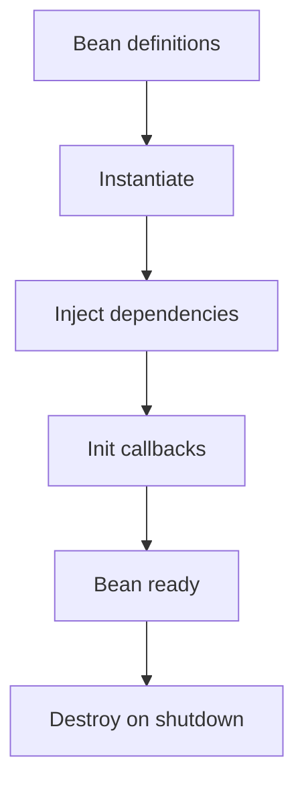

# Day 3 — Introduction to Spring (IoC, Beans, ApplicationContext)

## 🎯 Learning Objectives

By the end of this day you will understand:

- What the Spring Framework is, and why it was created
- Spring Framework vs Spring Boot vs Spring MVC vs Spring Cloud
- Inversion of Control (IoC) in plain language
- What a bean is, and what the Spring container / ApplicationContext does
- Component scanning as an idea (you will still wire objects by hand today)
- How a tiny IoC container works — so Spring stops looking like magic

**Spring Boot knowledge required:** none. We do **not** start Spring Boot today.

**Workload:** 1–2 hours theory, 2–3 hours coding the mini container.

---

# 1. Concept — What is Spring?

## What is it?

**Spring** is a Java framework that **creates your objects**, **connects them**, and **gives you extra services** (HTTP, transactions, security) around those objects.

The original Spring Framework (2003, Rod Johnson) attacked a real problem: enterprise Java (EJB 2) was heavy, XML-bombarded, and hard to test. Spring said:

> Write normal Java classes. Let a container wire them.

## Why do we need it?

Without a container you write:

```java
UserRepository repo = new InMemoryUserRepository();
UserService service = new UserService(repo);
UserController controller = new UserController(service);
```

That is fine for 3 classes. At 80 classes, with transactions, data sources, and two payment gateways, **you** become the container — and you get it wrong. Spring is that wiring, standardized.

## Real-world analogy

A restaurant kitchen. Chefs do not mine iron to make pans. Someone **provides** the stove, the fridge, the tickets. Chefs cook. Spring provides the stove.

## Backend example

```text
You write:   UserService(UserRepository)
Spring does: new InMemoryUserRepository()
             new UserService(thatRepository)
             keep both as "beans"
```

---

# 2. Problems with traditional Java backends (pre-Spring)

| Pain | What it looked like |
|---|---|
| Tight coupling | `new` everywhere; cannot test without a real database |
| Lookups | JNDI / Service Locator: `context.lookup("java:comp/env/jdbc/MyDB")` |
| Boilerplate | Manual JDBC `try/finally` close connections |
| Testing | Need a full application server to test a method |
| XML / EJB | Hundreds of deployment descriptors |

Spring’s answer: **plain objects + dependency injection + portable services**.

---

# 3. Spring Framework vs Spring Boot vs Spring MVC vs Spring Cloud

These names get mixed in every interview. Memorize this table.

| Name | What it is |
|---|---|
| **Spring Framework** | Core: IoC container, AOP, transactions, Spring MVC. You configure a lot yourself. |
| **Spring MVC** | The web module of Spring Framework. `DispatcherServlet`, `@Controller`. |
| **Spring Boot** | Opinionated **on top of** Spring. Auto-configuration, embedded Tomcat, starters, `application.properties`. Same container, less XML/Java config. |
| **Spring Cloud** | Patterns for **distributed** systems (config server, discovery). **Out of scope** for this 30-day course. |

```text
Spring Cloud          (microservices — not this course)
    ↑
Spring Boot           (auto-config + executable jar)
    ↑
Spring Framework      (IoC + MVC + transactions)
    ↑
Java
```

**Interview sentence:**

> Spring Boot is not a replacement for Spring. It is a faster way to start a Spring application.

---

# 4. Inversion of Control — the idea that matters

## What is it?

**Inversion of Control (IoC)** means **you no longer construct your dependencies**. Something else (the container) does.

**Control of what?** Control of *who creates objects and when*.

## Why do we need it?

Day 1’s `UserService` already did a small inversion:

```java
public UserService(UserRepository users) {
    this.users = users;
}
```

`UserService` does **not** decide which repository. `main` (today) or Spring (soon) decides.

## Real-world analogy

You do not hire your own manager. The company assigns one. You receive a collaborator; you don’t `new` your boss.

## Tight coupling vs loose coupling

**Tight** — the class builds its own dependency:

```java
public class Car {
    private final Engine engine = new PetrolEngine();
}
```

`Car` cannot be tested with a fake engine. Changing to electric requires editing `Car`.

**Loose** — the class **asks** for an `Engine`:

```java
public class Car {
    private final Engine engine;
    public Car(Engine engine) {
        this.engine = engine;
    }
}
```

## Backend example

```java
class OrderService {
    private final PaymentGateway payments;
    OrderService(PaymentGateway payments) {
        this.payments = payments;
    }
}
```

Tests pass a `FakePaymentGateway`. Production gets `StripePaymentGateway`. Same `OrderService`.

---

# 5. Beans, container, ApplicationContext

## What is a bean?

A **bean** is an object **created and managed by the container**.

Not every object is a bean. `new ArrayList<>()` inside a method is a normal object. `UserService` registered with Spring is a bean.

Default scope: **singleton** — one instance for the whole application.

## What is the container?

The **Spring IoC container** is the runtime that:

1. Reads configuration (annotations, `@Bean` methods, historically XML)
2. Instantiates beans
3. Injects dependencies
4. Calls lifecycle callbacks
5. Hands you beans when you ask (`getBean`)

## What is ApplicationContext?

`ApplicationContext` is the **interface** you use to talk to the container.

```java
ApplicationContext ctx = ...;
UserService service = ctx.getBean(UserService.class);
```

In Spring Boot you almost never call `getBean` yourself. The container injects. Calling `getBean` from random code is a **service locator** smell.

## Bean lifecycle (high level — Day 4 goes deeper)

```text
1. Load bean definitions (scan / config)
2. Instantiate (call constructor)
3. Inject dependencies
4. Aware callbacks (optional)
5. @PostConstruct / afterPropertiesSet
6. Bean is ready
7. On shutdown: @PreDestroy
```



---

# 6. Component scanning (idea only)

Spring looks at a **base package**, finds classes with `@Component` / `@Service` / `@Repository` / `@Controller`, and registers them as beans.

```text
com.course.backend          ← @SpringBootApplication lives here
com.course.backend.service  ← scanned
com.course.backend.web      ← scanned
com.other.company           ← NOT scanned
```

If your class is outside the scan, Spring never creates it → `NoSuchBeanDefinitionException`.

Today you will **simulate** scanning by registering classes in a `Map` yourself.

---

# 7. How It Works — a container in 40 lines of Java

You will build `SimpleContainer`:

- `register(Class type, Object instance)`
- `getBean(Class type)`

Then you register `PetrolEngine` and `Car`. `Car` needs an `Engine`. **You** still pass it in today — so you feel the pain Spring removes tomorrow.

Then you add `createCarAutomatically()` that looks at `Car`’s constructor, sees `Engine`, fetches the engine bean, and calls `new Car(engine)` via reflection.

**That last step is IoC.** Spring does this for every bean.

```text
register Engine
register Car  →  container sees Car(Engine)
              →  get Engine bean
              →  invoke constructor
              →  store Car bean
```

---

# 8. Write this on your machine (file by file)

Do **not** copy the whole folder. Create each file yourself. Answer key:

```text
java-springboot-backend/practical/day-03/src/com/course/day03/
```

### Step 0 — folder

```bash
mkdir -p ~/springboot-practice/day-03/src/com/course/day03
cd ~/springboot-practice/day-03
```

| # | File | Why it exists |
|---|---|---|
| 1 | `Engine.java` | Abstraction the car depends on |
| 2 | `PetrolEngine.java` | One implementation |
| 3 | `ElectricEngine.java` | Second implementation — proves the car does not care |
| 4 | `Car.java` | Consumer; constructor injection; **no `new Engine()`** |
| 5 | `SimpleContainer.java` | Tiny IoC container (the teaching point) |
| 6 | `Day03App.java` | Register beans, create car automatically, drive |

```bash
javac -d out src/com/course/day03/*.java
java -cp out com.course.day03.Day03App
```

Expected:

```text
Petrol engine started
Car driving with: petrol
--- swap implementation ---
Electric engine started
Car driving with: electric
```

---

## File 1 — `Engine.java`

**Path:** `src/com/course/day03/Engine.java`

```java
package com.course.day03;

public interface Engine {
    String type();

    void start();
}
```

**Why:** `Car` must depend on an interface, not `PetrolEngine`. That is loose coupling.

---

## File 2 — `PetrolEngine.java`

**Path:** `src/com/course/day03/PetrolEngine.java`

```java
package com.course.day03;

public class PetrolEngine implements Engine {

    @Override
    public String type() {
        return "petrol";
    }

    @Override
    public void start() {
        System.out.println("Petrol engine started");
    }
}
```

---

## File 3 — `ElectricEngine.java`

**Path:** `src/com/course/day03/ElectricEngine.java`

```java
package com.course.day03;

public class ElectricEngine implements Engine {

    @Override
    public String type() {
        return "electric";
    }

    @Override
    public void start() {
        System.out.println("Electric engine started");
    }
}
```

---

## File 4 — `Car.java`

**Path:** `src/com/course/day03/Car.java`

```java
package com.course.day03;

public class Car {

    private final Engine engine;

    public Car(Engine engine) {
        if (engine == null) {
            throw new IllegalArgumentException("engine is required");
        }
        this.engine = engine;
    }

    public void drive() {
        engine.start();
        System.out.println("Car driving with: " + engine.type());
    }
}
```

**Line by line**

- `private final Engine engine` — required collaborator, assigned once.
- Constructor receives `Engine`, not a concrete class.
- `drive()` uses the engine; it never constructs one.

If you wrote `new PetrolEngine()` here, swapping to electric would require editing `Car`. That is the problem Spring exists to solve.

---

## File 5 — `SimpleContainer.java`

**Path:** `src/com/course/day03/SimpleContainer.java`

This is **simplified for learning**. Real Spring handles cycles, scopes, proxies, `@Qualifier`, generics, and a bean lifecycle. You are learning the **shape**.

```java
package com.course.day03;

import java.lang.reflect.Constructor;
import java.util.HashMap;
import java.util.Map;

public class SimpleContainer {

    private final Map<Class<?>, Object> beans = new HashMap<>();

    public void register(Class<?> type, Object instance) {
        beans.put(type, instance);
    }

    @SuppressWarnings("unchecked")
    public <T> T getBean(Class<T> type) {
        Object bean = beans.get(type);
        if (bean == null) {
            throw new IllegalStateException("No bean of type " + type.getName());
        }
        return (T) bean;
    }

    /**
     * IoC: look at the constructor, fetch each parameter as a bean,
     * invoke the constructor, register the result.
     */
    public <T> T create(Class<T> type) {
        try {
            Constructor<?> constructor = type.getDeclaredConstructors()[0];
            Class<?>[] paramTypes = constructor.getParameterTypes();
            Object[] args = new Object[paramTypes.length];
            for (int i = 0; i < paramTypes.length; i++) {
                args[i] = getBean(paramTypes[i]);
            }
            @SuppressWarnings("unchecked")
            T instance = (T) constructor.newInstance(args);
            register(type, instance);
            return instance;
        } catch (ReflectiveOperationException ex) {
            throw new IllegalStateException("Cannot create " + type.getName(), ex);
        }
    }
}
```

**What Spring does that you just did**

| You | Spring |
|---|---|
| `register(Engine.class, new PetrolEngine())` | `@Component` on `PetrolEngine` + scan |
| `create(Car.class)` | `@Component` on `Car`; constructor injection |
| `getBean(Car.class)` | Inject `Car` into whoever needs it |

**Common production error this predicts:** if `Engine` is not registered, `getBean` throws. Spring’s version is `NoSuchBeanDefinitionException`.

---

## File 6 — `Day03App.java`

**Path:** `src/com/course/day03/Day03App.java`

```java
package com.course.day03;

public class Day03App {

    public static void main(String[] args) {
        SimpleContainer container = new SimpleContainer();
        container.register(Engine.class, new PetrolEngine());
        Car petrolCar = container.create(Car.class);
        petrolCar.drive();

        System.out.println("--- swap implementation ---");

        SimpleContainer electric = new SimpleContainer();
        electric.register(Engine.class, new ElectricEngine());
        Car electricCar = electric.create(Car.class);
        electricCar.drive();
    }
}
```

**Notice:** `Car` source code did not change. Only registration changed. That is IoC.

You still wrote `new PetrolEngine()` in `main`. Spring will take that last `new` away with scanning. The **inversion** already happened for `Car`.

---

# 9. Spring ecosystem (map, do not memorize products)

```text
spring-core          IoC, ApplicationContext
spring-beans         bean factory
spring-context       ApplicationContext implementations
spring-aop           proxies, @Transactional support
spring-web / webmvc  DispatcherServlet
spring-data          repositories (later)
spring-security      later
spring-boot          auto-config on top
```

Boot starters (`spring-boot-starter-web`) just pull these jars with versions aligned.

---

# 10. Common Mistakes

1. **Thinking Spring Boot is a different framework.** It starts a Spring `ApplicationContext`.
2. **Calling the database “the backend”.** The backend is the process; Spring is the process’s wiring.
3. **`new` inside a service for another service.** That bypasses the container — no proxy, no `@Transactional`.
4. **Fetching beans with a static `SpringContext.getBean` everywhere.** Service locator; hard to test.
5. **Assuming two classes with the same type both get injected.** The container needs one unambiguous bean (Day 4: `@Primary` / `@Qualifier`).
6. **Putting `@SpringBootApplication` in package `com`** — it scans the entire world. Keep it in `com.course.backend`.

---

# 11. Practical Exercise

After the six files run:

1. Add `DieselEngine`. Register it instead of petrol. `Car` must not change.
2. Add `Radio` with a no-arg constructor. Change `Car` to `Car(Engine engine, Radio radio)`. Register a `Radio` bean. `create(Car.class)` should still work.
3. Intentionally **forget** to register `Radio`. Read the exception. That is `NoSuchBeanDefinitionException` in Spring clothing.

---

# 12. Mini Project — IoC for Day 1’s UserService

Reuse yesterday’s idea:

- `UserRepository` interface
- `InMemoryUserRepository`
- `UserService(UserRepository)`
- Register the repository, `create(UserService.class)`, call `create("Ada", "ada@example.com")`.

You may copy Day 1 classes into `day-03` or import them. The point is: **`UserService` is now created by the container.**

---

# 13. Interview Questions

## Easy

### Q1. What is Spring?

**Difficulty:** Easy

**Answer:** A Java framework whose core is an IoC container that creates and wires objects (beans), plus modules for web, data, and transactions.

**Simple Explanation:** Spring builds and connects your classes for you.

**Example:** It constructs `UserService` and passes it a `UserRepository`.

**Interview Tip:** Do not start with “Spring Boot is for microservices.”

**Common Follow-up Question:** Spring vs Spring Boot?

---

### Q2. What is a Spring bean?

**Difficulty:** Easy

**Answer:** An object instantiated, assembled, and managed by the Spring IoC container.

**Simple Explanation:** An object Spring owns.

**Example:** A `@Service` class is a bean; `new ArrayList<>()` inside a method is not.

**Interview Tip:** Mention default singleton scope.

**Common Follow-up Question:** Are all Java objects beans? (No.)

---

### Q3. What is IoC?

**Difficulty:** Easy

**Answer:** Inversion of Control: the framework calls you and provides dependencies, instead of your code constructing everything.

**Simple Explanation:** You don’t `new` your collaborators; the container does.

**Example:** `Car(Engine engine)` instead of `new PetrolEngine()` inside `Car`.

**Interview Tip:** IoC is the principle; DI is the technique.

**Common Follow-up Question:** Is the Factory pattern IoC? (A mild form, yes.)

---

### Q4. What is ApplicationContext?

**Difficulty:** Easy

**Answer:** The central Spring interface for the IoC container: bean factory plus enterprise services (events, i18n, resources).

**Simple Explanation:** The object that holds all beans.

**Example:** `ctx.getBean(UserService.class)` — avoid in app code.

**Interview Tip:** `BeanFactory` is the smaller parent; `ApplicationContext` is what you use.

**Common Follow-up Question:** `AnnotationConfigApplicationContext` vs Boot’s context?

---

### Q5. Spring Framework vs Spring Boot?

**Difficulty:** Easy

**Answer:** Boot auto-configures Spring, adds an embedded server, starters, and production extras (actuator, fat jar). Underneath it is still Spring.

**Simple Explanation:** Boot is Spring with batteries included.

**Example:** One `@SpringBootApplication` vs XML + Tomcat install.

**Interview Tip:** “Boot is not a replacement.”

**Common Follow-up Question:** Can you use Spring MVC without Boot? (Yes.)

---

## Medium

### Q1. IoC vs Dependency Injection?

**Difficulty:** Medium

**Answer:** IoC is the broad idea of handing control to a framework. DI is the specific IoC technique of passing dependencies in (constructor/setter/field). Hollywood principle: “Don’t call us, we’ll call you.”

**Simple Explanation:** IoC = who is in charge; DI = how collaborators arrive.

**Example:** Servlet container calling `doGet` is IoC without being Spring DI.

**Interview Tip:** Interviewers want this distinction.

**Common Follow-up Question:** Other IoC examples? (Template method, events.)

---

### Q2. What is tight coupling? Why does it hurt backends?

**Difficulty:** Medium

**Answer:** A class depends on a concrete collaborator it constructs. You cannot swap implementations, test with fakes, or apply transactional proxies.

**Simple Explanation:** Glued together with `new`.

**Example:** `private final Engine engine = new PetrolEngine();`

**Interview Tip:** Follow with constructor injection as the fix.

**Common Follow-up Question:** Is depending on an interface still coupling? (To an abstraction — desirable.)

---

### Q3. What does component scanning do?

**Difficulty:** Medium

**Answer:** It inspects a base package for stereotype annotations and registers those classes as bean definitions.

**Simple Explanation:** Spring walks packages and keeps annotated classes.

**Example:** `@SpringBootApplication` in `com.course.backend` scans that package downward.

**Interview Tip:** Wrong package = missing bean.

**Common Follow-up Question:** How do you scan an extra package? (`@ComponentScan`)

---

### Q4. Why is `getBean` in business code a smell?

**Difficulty:** Medium

**Answer:** It hides dependencies. The class needs the container to exist. Tests must start Spring. Constructor parameters make dependencies visible and mockable.

**Simple Explanation:** Don’t ask the fridge for a chef on every order; receive the chef.

**Example:** Prefer `OrderService(PaymentGateway g)` over `ctx.getBean(PaymentGateway.class)`.

**Interview Tip:** Name it “service locator anti-pattern”.

**Common Follow-up Question:** When is `getBean` OK? (Framework glue, rare.)

---

### Q5. Default bean scope and why it matters.

**Difficulty:** Medium

**Answer:** Singleton: one instance per container. Beans must be thread-safe regarding instance fields. Do not store per-request user state on a singleton service.

**Simple Explanation:** One `UserService` for the whole app.

**Example:** A `List<Order>` field on a singleton service is a data leak.

**Interview Tip:** Connect to Day 2’s `static` warning — same bug, different keyword.

**Common Follow-up Question:** What is request scope? (One bean per HTTP request — rare in APIs.)

---

## Hard

### Q1. Explain what happens internally when Spring creates `Car` with an `Engine` dependency.

**Difficulty:** Hard

**Why?** Proves you understand the container, not just annotations.

**How?** Bean definitions loaded → `Engine` created first (dependency order) → constructor of `Car` invoked with that instance → both stored.

**When?** Application startup, not on first HTTP request (for singletons).

**Trade-offs:** Startup cost vs request latency. Fail-fast if wiring is wrong.

**Real-world example:** App refuses to start with `NoSuchBeanDefinitionException` instead of 500 later.

**Answer:** Spring builds a dependency graph, instantiates leaves first, calls constructors, applies callbacks.

**Simple Explanation:** It does what `SimpleContainer.create` did, with a graph.

**Example:** Today’s `SimpleContainer`.

**Interview Tip:** Draw the graph.

**Common Follow-up Question:** Circular dependency? (Constructor injection fails; setter might cycle; Boot 2.6+ rejects cycles by default.)

---

### Q2. How would you explain Spring to a Java developer who has never used a framework?

**Difficulty:** Hard

**Answer:** Start with `new` and constructor injection in `main`. Show the pain of 50 `new`s. Introduce a map of types to instances. Then say Spring is a battle-tested version of that map plus web, data, and transactions.

**Simple Explanation:** A smart factory for your classes.

**Example:** Walk through today’s files.

**Interview Tip:** Teaching ability is a senior signal.

**Common Follow-up Question:** Then why Boot? (Auto-config of that factory.)

---

### Q3. `NoSuchBeanDefinitionException` vs `NoUniqueBeanDefinitionException`.

**Difficulty:** Hard

**Answer:** None vs more than one bean of the required type. First: missing scan, missing `@Component`, wrong type. Second: two `@Component` implementations of one interface without `@Primary`/`@Qualifier`.

**Simple Explanation:** Zero matches vs two matches.

**Example:** `PetrolEngine` and `ElectricEngine` both registered as `Engine` — Spring cannot inject `Engine` until you choose.

**Interview Tip:** You will see both in real jobs.

**Common Follow-up Question:** How do you inject all implementations? (`List<Engine>`)

---

### Q4. Why were EJBs considered heavy compared to Spring?

**Difficulty:** Hard

**Answer:** EJB 2 required container interfaces, XML, a full app server, and was hard to unit test. Spring popularized POJOs + DI that run in tests with a lightweight context (or no context).

**Simple Explanation:** Spring let you write normal classes.

**Example:** `Car` has no Spring import today and still demonstrates IoC.

**Interview Tip:** Historical questions still appear at banks.

**Common Follow-up Question:** Are EJBs dead? (Jakarta EE exists; Spring won mindshare.)

---

### Q5. If two modules each create their own `ApplicationContext`, what goes wrong?

**Difficulty:** Hard

**Answer:** Two containers, two singleton sets, two caches, possibly two DataSources. Beans in A cannot inject beans in B unless you build a parent/child context. In Boot you want **one** application context.

**Simple Explanation:** Two kitchens that cannot share a fridge.

**Example:** Accidental `new AnnotationConfigApplicationContext()` inside a request.

**Interview Tip:** “Don’t start a context inside a context.”

**Common Follow-up Question:** Parent/child contexts in Spring MVC (historically servlet + root). Boot simplified this.

---

# 14. Day-End Practice

1. Draw IoC vs `new` on paper.
2. Recite Spring vs Boot vs MVC vs Cloud in four sentences.
3. Break `SimpleContainer` by omitting a registration; read the stack trace.
4. Explain “bean” to an intern without saying “annotation”.
5. List three objects in a backend that should **not** be singletons holding user data.

---

# 15. Quick Revision

- Spring = IoC container + modules.
- Boot = faster Spring, not a different runtime.
- IoC: container creates dependencies.
- DI: passing those dependencies in.
- Bean: container-managed object, singleton by default.
- `ApplicationContext`: the container API.
- Today you built a tiny container with reflection. That is the whole trick.

---

# 16. What You Should Be Able To Explain

- Why Spring was created
- Tight vs loose coupling with a `Car`/`Engine` example
- What a bean is
- What the container does at startup
- Why `getBean` in services is a smell
- Spring vs Spring Boot in one breath

**Tomorrow:** constructor vs setter vs field injection, bean lifecycle, `@Primary`, and why constructor injection is the default.

**Next:** [Day 4](../day-04-dependency-injection/README.md)
