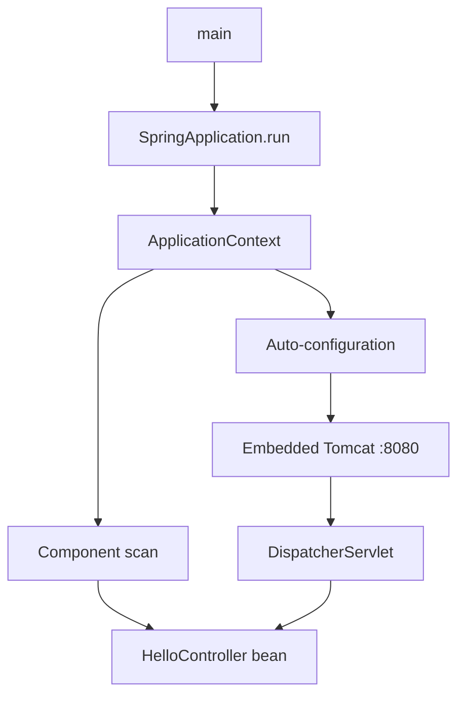

# Day 5 — Spring Boot Fundamentals

## 🎯 Learning Objectives

By the end of this day you will understand:

- What Spring Boot adds on top of Spring (auto-configuration, starters, embedded server, fat jar)
- How to create a project with Spring Initializr and Maven
- Every generated file: why it exists
- `pom.xml`, `src/main/java`, `src/main/resources`, `application.properties` vs `application.yml`
- The main class and `@SpringBootApplication`
- How to run the app and hit a first endpoint

**You will type a real Maven project on your machine.**

---

# 1. Concept — What is Spring Boot?

## What is it?

Spring Boot is **an opinionated layer on the Spring Framework** that:

1. **Auto-configures** beans you almost always need (Jackson, Tomcat, DataSource when a driver is on the classpath)
2. **Starts an embedded server** so you run a jar, not a WAR dropped into external Tomcat
3. **Manages versions** via `spring-boot-starter-parent`
4. **Exposes configuration** through `application.properties` / env vars / profiles

## Why do we need it?

Day 3–4 taught the container. Boot **starts that container with sensible defaults** so you can write a controller on day one instead of XML.

## Real-world analogy

Spring Framework is a professional kitchen you assemble. Spring Boot is a food truck that already has a stove, a ticket rail, and a serving window. You still cook (write Java). You don’t weld the truck.

## Backend example

```java
@SpringBootApplication
public class Day05Application {
    public static void main(String[] args) {
        SpringApplication.run(Day05Application.class, args);
    }
}
```

That `run` call: creates `ApplicationContext`, runs auto-config, starts Tomcat on 8080.

---

# 2. Spring vs Spring Boot (again, with files)

| Task | Plain Spring | Spring Boot |
|---|---|---|
| Start web | Deploy WAR to Tomcat | `java -jar app.jar` |
| Jackson | Manual `HttpMessageConverter` bean | Auto if web starter present |
| DataSource | XML or `@Bean` | Properties + driver on classpath |
| Versions | Align 12 jars yourself | Parent POM BOM |

Boot **does not replace** `@Service`, DI, or MVC. It **configures** them.

---

# 3. Auto-configuration (high level)

Boot looks at:

1. **Classpath** — is `spring-webmvc` present? then configure DispatcherServlet.
2. **Your beans** — if you already defined a `DataSource`, it backs off.
3. **Properties** — `spring.datasource.url=...`

Classes named `*AutoConfiguration` live in `spring-boot-autoconfigure`. They are listed in `META-INF/spring/org.springframework.boot.autoconfigure.AutoConfiguration.imports` (Boot 3; Boot 2 used `spring.factories`).

**You do not memorize those classes.** You memorize the rule: *starter on classpath + properties → beans appear.*

If a feature differs significantly: **Spring Boot 2** used `javax.*` and `spring.factories`. **Spring Boot 3** (this course) uses `jakarta.*` and `AutoConfiguration.imports`. **Spring Boot 4** continues the Boot 3 programming model with a newer framework generation.

---

# 4. Maven and pom.xml

Maven is the build tool. The **parent POM** imports a bill of materials (BOM) so starter versions match.

Important commands:

```bash
./mvnw spring-boot:run
./mvnw test
./mvnw clean
./mvnw package
```

| Goal | Command |
|---|---|
| Run app | `./mvnw spring-boot:run` |
| Tests | `./mvnw test` |
| Delete `target/` | `./mvnw clean` |
| Build jar | `./mvnw package` |

`./mvnw` is the **Maven Wrapper** — a script that downloads the right Maven. Teammates don’t need Maven installed.

Lifecycle: `validate → compile → test → package → verify → install → deploy`.

---

# 5. Project structure — why every file exists

```text
day-05/
├── pom.xml                          build + dependencies
├── src/main/java/com/course/day05/
│   ├── Day05Application.java        JVM entry + @SpringBootApplication
│   └── HelloController.java         HTTP endpoint
└── src/main/resources/
    └── application.properties       configuration
```

| File | Why it exists |
|---|---|
| `pom.xml` | Tells Maven how to compile and which jars to download. Not generated “just because”. Without it there is no reproducible build. |
| `Day05Application.java` | `main` starts the JVM; `@SpringBootApplication` starts the container. |
| `src/main/java` | Production code. Maven compiles it to `target/classes`. |
| `src/main/resources` | Non-Java files on the classpath (`application.properties`, later `static/`, templates). |
| `src/test/java` | Tests (Day 27). Same package allowed to see package-private types. |
| `application.properties` | Externalized config so you don’t recompile to change the port. |
| `target/` | Build output. **Never commit it.** |

**Package rule:** put `@SpringBootApplication` in `com.course.day05`, controllers in subpackages. If you put the main class in `com` it scans everything.

---

# 6. `@SpringBootApplication`

It is a **composed annotation**:

```text
@SpringBootApplication
  = @SpringBootConfiguration  (it's a @Configuration)
  + @EnableAutoConfiguration
  + @ComponentScan
```

- `@Configuration` — this class can declare `@Bean` methods
- `@EnableAutoConfiguration` — load auto-config
- `@ComponentScan` — find `@Component` in this package and below

---

# 7. application.properties vs application.yml

Both are valid. This course uses `.properties` first (simpler), YAML when nested config grows.

```properties
server.port=8080
spring.application.name=day05
```

```yaml
server:
  port: 8080
spring:
  application:
    name: day05
```

Same meaning. Do not mix conflicting values in both files without knowing precedence (later: Day 28).

**Never put production passwords in these files in git.** Use env vars: `SPRING_DATASOURCE_PASSWORD`.

---

# 8. How It Works — first request

```text
java -jar / ./mvnw spring-boot:run
        ↓
SpringApplication.run
        ↓
Create ApplicationContext
        ↓
@ComponentScan finds HelloController
        ↓
Auto-config starts Tomcat on 8080
        ↓
GET /api/hello
        ↓
DispatcherServlet → HelloController.hello()
        ↓
Jackson → JSON
```



---

# 9. Write this on your machine (file by file)

### Step 0 — create the Maven layout

```bash
mkdir -p ~/springboot-practice/day-05/src/main/java/com/course/day05
mkdir -p ~/springboot-practice/day-05/src/main/resources
cd ~/springboot-practice/day-05
```

**Option A (recommended once):** https://start.spring.io — Maven, Java 21, Spring Boot 3.4.x, dependency **Spring Web**, group `com.course`, artifact `day05`. Then still **type** the controller yourself.

**Option B:** type every file below.

Answer key: `java-springboot-backend/practical/day-05/`

| # | File | Why it exists |
|---|---|---|
| 1 | `pom.xml` | Parent + `spring-boot-starter-web` |
| 2 | `application.properties` | Port and app name |
| 3 | `Day05Application.java` | Entry point |
| 4 | `HelloController.java` | First REST endpoint |

If you have Maven installed:

```bash
cd ~/springboot-practice/day-05
mvn spring-boot:run
```

Then:

```bash
curl http://localhost:8080/api/hello
```

Expected: `{"message":"Hello, Spring Boot"}`

Postman: GET `http://localhost:8080/api/hello` → 200.

---

## File 1 — `pom.xml`

**Path:** `pom.xml` (project root, not inside `src`)

Type the file from `practical/day-05/pom.xml`.

**Line by line (the parts that matter):**

- `<parent>spring-boot-starter-parent` — version BOM, Java plugin defaults
- `<java.version>21</java.version>`
- `spring-boot-starter-web` — Tomcat + MVC + Jackson
- `spring-boot-starter-test` — JUnit 5 + Mockito + MockMvc (you will use Day 27)
- `spring-boot-maven-plugin` — builds the executable jar

There is **no** version on `starter-web`. The parent manages it. That is the point of the parent.

---

## File 2 — `src/main/resources/application.properties`

```properties
server.port=8080
spring.application.name=day05
```

`server.port` — Tomcat listen port. Change to `8081` if 8080 is taken (`Port already in use`).

---

## File 3 — `Day05Application.java`

**Path:** `src/main/java/com/course/day05/Day05Application.java`

```java
package com.course.day05;

import org.springframework.boot.SpringApplication;
import org.springframework.boot.autoconfigure.SpringBootApplication;

@SpringBootApplication
public class Day05Application {

    public static void main(String[] args) {
        SpringApplication.run(Day05Application.class, args);
    }
}
```

**Imports:** `SpringApplication` starts Boot; `@SpringBootApplication` enables scan + auto-config.

**Class:** must be public. Name does not have to end with `Application`, but convention helps.

**main:** JVM entry. `run` returns `ConfigurableApplicationContext` (you ignore it).

**What Spring does:** scans `com.course.day05`, starts Tomcat, keeps running until Ctrl+C.

---

## File 4 — `HelloController.java`

**Path:** `src/main/java/com/course/day05/HelloController.java`

```java
package com.course.day05;

import java.util.Map;
import org.springframework.web.bind.annotation.GetMapping;
import org.springframework.web.bind.annotation.RestController;

@RestController
public class HelloController {

    @GetMapping("/api/hello")
    public Map<String, String> hello() {
        return Map.of("message", "Hello, Spring Boot");
    }
}
```

**`@RestController`:** stereotype = `@Controller` + `@ResponseBody`. Return values become the HTTP body (JSON via Jackson).

**`@GetMapping("/api/hello")`:** HTTP GET, path `/api/hello`.

**Return `Map`:** Jackson serializes to JSON. Later you will return records (DTOs). A Map is acceptable for this hello.

**Request flow:**

```text
GET /api/hello
  → Tomcat
  → DispatcherServlet
  → HelloController.hello
  → Map
  → Jackson
  → 200 application/json
```

---

# 10. Debugging today

| Error | Meaning | Fix |
|---|---|---|
| Port already in use | 8080 taken | `server.port=8081` or kill the other process |
| `Cannot find symbol SpringApplication` | Missing starter / Maven not imported | Reimport Maven |
| 404 on `/api/hello` | Controller not scanned | Main class package must be a parent of the controller package |
| Whitelabel error page | Boot HTML for unmapped path or thrown error | Check the URL and logs |

---

# Interview Questions

## Easy

### Q1. What is Spring Boot?

**Difficulty:** Easy

**Answer:**

A project that auto-configures Spring, embeds a server, and provides starters so you can run a production-grade app from a main method.

**Simple Explanation:**

Spring with defaults and an embedded Tomcat.

**Example:**

```java
@SpringBootApplication
public class Day05Application {}
```

**Interview Tip:**

Say it is not a replacement for Spring.

**Common Follow-up Question:**

What is a starter?

### Q2. What is `@SpringBootApplication`?

**Difficulty:** Easy

**Answer:**

Composed of `@SpringBootConfiguration`, `@EnableAutoConfiguration`, and `@ComponentScan`.

**Simple Explanation:**

The annotation on the main class that starts everything.

**Example:**

```java
@SpringBootApplication
```

**Interview Tip:**

Mention the three meta-annotations.

**Common Follow-up Question:**

Where should the class live? (Root package.)

### Q3. What is a Spring Boot starter?

**Difficulty:** Easy

**Answer:**

A dependency descriptor that pulls a curated set of jars (e.g. `spring-boot-starter-web` → MVC, Tomcat, Jackson) with matching versions.

**Simple Explanation:**

A bundle of libraries that work together.

**Example:**

```xml
<artifactId>spring-boot-starter-web</artifactId>
```

**Interview Tip:**

You usually don’t set a version on starters when using the parent.

**Common Follow-up Question:**

starter-web vs starter-data-jpa?

### Q4. Why `application.properties`?

**Difficulty:** Easy

**Answer:**

Externalized configuration: change port, names, URLs without recompiling. Later: env vars and profiles override these values.

**Simple Explanation:**

Settings file on the classpath.

**Example:**

```properties
server.port=8080
```

**Interview Tip:**

Never commit real secrets.

**Common Follow-up Question:**

properties vs yml?

### Q5. How do you run a Boot app?

**Difficulty:** Easy

**Answer:**

`main` via IDE, `./mvnw spring-boot:run`, or `java -jar target/*.jar` after `package`.

**Simple Explanation:**

Run the main class or the jar.

**Example:**

```bash
mvn spring-boot:run
```

**Interview Tip:**

Mention the wrapper `mvnw`.

**Common Follow-up Question:**

What does `package` produce? (Executable jar.)


## Medium

### Q1. How does auto-configuration decide what to create?

**Difficulty:** Medium

**Answer:**

Conditional annotations (`@ConditionalOnClass`, `@ConditionalOnMissingBean`, `@ConditionalOnProperty`) evaluated against classpath, existing beans, and properties.

**Simple Explanation:**

If the jar is there and you didn’t already define the bean, Boot creates it.

**Example:**

Web starter present → DispatcherServlet bean appears.

**Interview Tip:**

You don’t list every condition in an interview; name two.

**Common Follow-up Question:**

How do you exclude an auto-config? (`@SpringBootApplication(exclude=...)`.)

### Q2. Why put the main class in the root package?

**Difficulty:** Medium

**Answer:**

`@ComponentScan` defaults to that package and subpackages. A main class in `com.course.day05.app` will not see `com.course.day05.controller`.

**Simple Explanation:**

Scan starts at the main class.

**Example:**

```text
com.course.day05.Day05Application
com.course.day05.HelloController
```

**Interview Tip:**

Classic 404 cause.

**Common Follow-up Question:**

How to scan extra packages? `@ComponentScan(basePackages=...)`.

### Q3. Explain `spring-boot-starter-parent`.

**Difficulty:** Medium

**Answer:**

A parent POM that manages dependency versions (BOM), compiler plugin, and resource filtering. Child POMs omit versions for starters.

**Simple Explanation:**

A version catalog + plugin defaults.

**Example:**

```xml
<parent>spring-boot-starter-parent</parent>
```

**Interview Tip:**

You can use `spring-boot-dependencies` BOM without being a child, if the company has another parent.

**Common Follow-up Question:**

What if the company parent is not Boot? (import BOM in dependencyManagement.)

### Q4. Embedded Tomcat vs external Tomcat.

**Difficulty:** Medium

**Answer:**

Boot packages Tomcat inside the jar and starts it in `main`. External Tomcat is an ops-managed server you deploy WARs into. Boot can still build a WAR; this course uses jar.

**Simple Explanation:**

The server is a library.

**Example:**

`java -jar app.jar` listens on 8080.

**Interview Tip:**

12-factor: the app is self-contained.

**Common Follow-up Question:**

Jetty/Undertow? (Change the starter.)

### Q5. Port already in use — how do you debug?

**Difficulty:** Medium

**Answer:**

Another process bound 8080 (old Boot run, Docker, another app). Change `server.port` or kill the process. On Linux `ss -ltnp | grep 8080`.

**Simple Explanation:**

Two waiters, one door.

**Example:**

```properties
server.port=8081
```

**Interview Tip:**

Don’t just reboot the laptop.

**Common Follow-up Question:**

How does Boot pick a random port? `server.port=0` — useful in tests.


## Hard

### Q1. Explain Spring Boot auto-configuration at a high level.

**Difficulty:** Hard

**Why?** Senior interview staple.

**How?** AutoConfiguration.imports lists classes. Each is a @Configuration with @Conditional*. Matches classpath and beans. Backs off if you defined your own.

**When?** Startup.

**Trade-offs:** Magic vs explicit @Bean — debugging is harder if you don’t know conditions.

**Real-world example:** Jackson ObjectMapper bean.

**Answer:**

Boot loads auto-config classes, evaluates conditions, registers beans you didn’t write.

**Simple Explanation:**

Convention over configuration, with an escape hatch.

**Example:**

```text
@ConditionalOnClass(DispatcherServlet.class)
```

**Interview Tip:**

Name `spring-boot-autoconfigure`.

**Common Follow-up Question:**

How to debug: `--debug` or `ConditionEvaluationReport`.

### Q2. What happens inside `SpringApplication.run`?

**Difficulty:** Hard

**Why?** Shows you don’t think main is empty.

**How?** Create SpringApplication, load env (properties, env vars, args), create context, invoke auto-config, refresh context (instantiate singletons), call runners, start embedded server.

**When?** Every boot.

**Trade-offs:** Refresh is fail-fast: bad wiring aborts.

**Real-world example:** Missing DataSource URL with JPA starter — fail at startup.

**Answer:**

Environment first, then context refresh, then web server.

**Simple Explanation:**

Build the kitchen, then open the window.

**Example:**

```java
SpringApplication.run(Day05Application.class, args);
```

**Interview Tip:**

Don’t recite 40 internal classes; hit environment, context, server.

**Common Follow-up Question:**

ApplicationRunner vs CommandLineRunner.

### Q3. How would you override an auto-configured bean?

**Difficulty:** Hard

**Why?** Escape hatch.

**How?** Declare your own @Bean of the same type. @ConditionalOnMissingBean on the auto-config means yours wins.

**When?** When defaults are wrong (custom ObjectMapper).

**Trade-offs:** You own the bean now — upgrades may surprise you.

**Real-world example:** Custom Jackson naming strategy.

**Answer:**

Your @Bean replaces the auto one because of OnMissingBean.

**Simple Explanation:**

If you brought your own, Boot steps aside.

**Example:**

```java
@Bean
ObjectMapper objectMapper() { return new ObjectMapper(); }
```

**Interview Tip:**

Mention you might lose Boot’s defaults (JavaTimeModule) — copy carefully.

**Common Follow-up Question:**

spring.jackson.* properties vs replacing the bean.

### Q4. Why is a fat jar different from a normal jar?

**Difficulty:** Hard

**Why?** Deployment.

**How?** Boot repackages: your classes + nested jars in BOOT-INF + a custom loader. `java -jar` uses PropertiesLauncher/JarLauncher, not a flat classpath.

**When?** Production deploys.

**Trade-offs:** Nested jars confuse some scanners; native image is a different path.

**Real-world example:** `target/day05-0.0.1-SNAPSHOT.jar`.

**Answer:**

The Boot plugin builds an executable archive with nested dependencies.

**Simple Explanation:**

A zip that knows how to run itself.

**Example:**

```bash
jar tf target/*.jar | head
```

**Interview Tip:**

Don’t unzip and expect a normal classpath.

**Common Follow-up Question:**

Layered jars for Docker (Day 29).

### Q5. Component scan accidentally picks a @Configuration from a library. What now?

**Difficulty:** Hard

**Why?** Startup surprises.

**How?** Narrow scan base packages, or exclude filters, or don’t put @SpringBootApplication too high.

**When?** When a util library contains stereotype annotations.

**Trade-offs:** Broad scan slows startup.

**Real-world example:** Main class in package `com`.

**Answer:**

Keep the application class in a tight root package.

**Simple Explanation:**

Don’t scan the universe.

**Example:**

```java
@SpringBootApplication(scanBasePackages = "com.course.day05")
```

**Interview Tip:**

This matches Day 3’s scan warning.

**Common Follow-up Question:**

spring.main.lazy-initialization — not a fix for extra beans.


---

# Practical Exercise

1. Change the message to include `spring.application.name` via `@Value("${spring.application.name}")`.
2. Change the port to 8081; curl the new URL.
3. Move `HelloController` to `com.other.HelloController` and observe 404; move it back.
4. Add GET `/api/health-lite` returning `{"status":"UP"}` (real Actuator is Day 28).

---

# Mini Project

Create GET `/api/time` returning `{"now":"<ISO-8601 Instant>"}` using `Instant.now()`. Type a new controller file. Do not stuff everything into `HelloController` forever — but two methods today is fine.

---

# Day-End Practice

1. Recite the three annotations inside `@SpringBootApplication`.
2. Draw the folder tree from memory.
3. Explain why `starter-web` has no version.
4. Hit `/api/hello` from Postman and from curl.
5. Read the startup log and find Tomcat’s port line.

---

# Quick Revision

- Boot = auto-config + embedded server + starters.
- Parent POM manages versions.
- Main class in the root package.
- `application.properties` for config.
- `@RestController` + `@GetMapping` = JSON endpoint.
- 404 often means scan missed the controller.

---

# What You Should Be Able To Explain

- Spring vs Spring Boot
- What a starter is
- Why the main class package matters
- How `mvn spring-boot:run` differs from `java -jar`
- What auto-configuration means at a high level

**Tomorrow:** stereotype annotations (`@Component`, `@Service`, `@Repository`, `@Bean`, `@Configuration`) with a working Boot app.

**Next:** [Day 6](../day-06-spring-boot-annotations/README.md)
