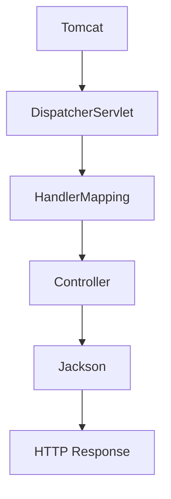

# Day 7 — Spring MVC and the request lifecycle

## 🎯 Learning Objectives

By the end of this day you will understand:

- What Spring MVC is (the web module, not a different product)
- The role of DispatcherServlet
- The HTTP request lifecycle inside Boot
- @RequestMapping and HTTP-method shortcuts
- Path variables, query params, headers, ResponseEntity

---

# 1. Concept — Spring MVC

## What is it?

**Spring MVC** is Spring’s web framework: a Front Controller (`DispatcherServlet`) routes HTTP to `@Controller` / `@RestController` methods.

## Why do we need it?

Raw servlets force you to parse URLs and JSON yourself. MVC maps a method to a route.

## Real-world analogy

A hotel concierge (DispatcherServlet) reads the request and walks you to the right desk (controller method).

## Backend example

`GET /api/demo/users/5?view=full` → `user(@PathVariable Long id, @RequestParam String view)`.

---

# 2. DispatcherServlet and the lifecycle

```text
HTTP request
    ↓
Embedded Tomcat
    ↓
DispatcherServlet   (Front Controller)
    ↓
HandlerMapping      (find @GetMapping)
    ↓
HandlerAdapter      (call the method, bind args)
    ↓
Controller method
    ↓
Return value
    ↓
HttpMessageConverter (Jackson) if @ResponseBody / @RestController
    ↓
HTTP response
```



**Boot auto-configures** `DispatcherServlet` because `starter-web` is on the classpath. You never write `web.xml` in this course.

---

# 3. Annotations you type today

| Annotation | Role |
|---|---|
| `@RequestMapping("/api/demo")` | Prefix for the class |
| `@GetMapping` | GET + path |
| `@PathVariable` | `{id}` in the path |
| `@RequestParam` | `?view=short` |
| `@RequestHeader` | header |
| `ResponseEntity` | status + body + headers |

`@PostMapping`, `@PutMapping`, `@PatchMapping`, `@DeleteMapping` are method-specific `@RequestMapping`s.

---

# 4. Argument binding

Spring converts `"5"` → `Long id`. If conversion fails → **400 Bad Request**.

Missing required `@RequestParam` → 400. Use `defaultValue` or `required = false`.


---

# Write this on your machine (file by file)

Do **not** copy-paste the whole answer-key folder. Create each file on your laptop, in order.

Suggested folder:

```bash
mkdir -p ~/springboot-practice/day-07
cd ~/springboot-practice/day-07
```

Answer key: `java-springboot-backend/practical/day-07/`

Maven layout like Day 5, package `com.course.day07`.

| # | File | Why it exists |
|---|---|---|
| 1 | `pom.xml` | starter-web |
| 2 | `Day07Application.java` | main |
| 3 | `application.properties` | port |
| 4 | `DemoController.java` | mappings to practice |

```bash
mvn spring-boot:run
curl http://localhost:8080/api/demo/ping
curl http://localhost:8080/api/demo/users/5?view=full
curl -H 'X-Request-Id: abc' http://localhost:8080/api/demo/who
```

Type `Day07Application.java` like previous days.

## File — `DemoController.java`

**Path:** `src/main/java/com/course/day07/DemoController.java`

Type the class from the answer key. Line by line:

- `@RequestMapping("/api/demo")` prefixes every method.
- `ping` returns a String — Jackson still wraps it as a JSON string (`"pong"`).
- `user` shows path + query.
- `who` shows `ResponseEntity` and an optional header.

**How Spring uses it:** `RequestMappingHandlerMapping` stores three `RequestMappingInfo`s at startup. Logs will list them.


---

# Common Mistakes

1. **Mixing class-level `/api` and method-level `/api/demo`** producing `/api/api/demo`.
2. **`@PathVariable String id` when you needed Long** — conversion errors.
3. **Forgetting `{id}` in the path** but declaring `@PathVariable`.
4. **Putting business logic in the controller** — preview of Day 10.
5. **404 vs 400:** 404 = no mapping; 400 = mapping found, binding failed.

---

# Practical Exercise

1. Add GET `/api/demo/search?q=` returning the query.
2. Add GET `/api/demo/status` returning `ResponseEntity.status(204).build()`.
3. Send a request to `/api/demo/users/abc` and observe 400.
4. Draw the lifecycle from memory.
5. Find the mapping log line in the console.

---

# Mini Project

Map GET `/api/demo/headers` that echoes `User-Agent` using `@RequestHeader`.

---

# Interview Questions

## Easy

### Q1. What is Spring MVC?

**Difficulty:** Easy

**Answer:**

The Spring web module built around DispatcherServlet mapping HTTP to controllers.

**Simple Explanation:**

The web part of Spring.

**Example:**

```java
@RestController
```

**Interview Tip:**

Not a separate language.

**Common Follow-up Question:**

MVC vs Boot?

### Q2. What is DispatcherServlet?

**Difficulty:** Easy

**Answer:**

The Front Controller that delegates to handlers.

**Simple Explanation:**

The concierge.

**Example:**

```text
Tomcat → DispatcherServlet → Controller
```

**Interview Tip:**

Name Front Controller pattern.

**Common Follow-up Question:**

Who creates it in Boot? (Auto-config.)

### Q3. @GetMapping vs @RequestMapping?

**Difficulty:** Easy

**Answer:**

@GetMapping is @RequestMapping(method=GET).

**Simple Explanation:**

A shortcut.

**Example:**

```java
@GetMapping("/ping")
```

**Interview Tip:**

Same for Post/Put/Delete.

**Common Follow-up Question:**

Can @RequestMapping still be used? (Yes.)

### Q4. Path vs query parameter?

**Difficulty:** Easy

**Answer:**

Path identifies a resource; query filters or views.

**Simple Explanation:**

/users/5 vs ?view=full

**Example:**

```java
@PathVariable Long id
```

**Interview Tip:**

REST design uses path for id.

**Common Follow-up Question:**

Optional query params?

### Q5. What is ResponseEntity?

**Difficulty:** Easy

**Answer:**

A type holding status, headers, and body.

**Simple Explanation:**

A full HTTP response object.

**Example:**

```java
return ResponseEntity.ok("hi");
```

**Interview Tip:**

Use when status is not always 200.

**Common Follow-up Question:**

ResponseEntity.noContent()?

## Medium

### Q1. What is HandlerMapping?

**Difficulty:** Medium

**Answer:**

Component that maps request to a handler method. RequestMappingHandlerMapping reads annotations.

**Simple Explanation:**

The lookup table of routes.

**Example:**

```text
GET /api/demo/ping → DemoController.ping
```

**Interview Tip:**

Startup logs mappings.

**Common Follow-up Question:**

Two methods same mapping? (IllegalStateException.)

### Q2. How are method arguments populated?

**Difficulty:** Medium

**Answer:**

HandlerAdapter + argument resolvers: path, query, body, headers, principal.

**Simple Explanation:**

Spring fills in parameters.

**Example:**

```java
@RequestParam String view
```

**Interview Tip:**

Conversion failures → 400.

**Common Follow-up Question:**

@RequestBody uses Jackson.

### Q3. 404 vs no controller bean?

**Difficulty:** Medium

**Answer:**

If the controller is not a bean, there is no mapping → 404. If mapping exists but id missing, still 404 for wrong URL.

**Simple Explanation:**

404 means DispatcherServlet found no handler.

**Example:**

Wrong package scan.

**Interview Tip:**

Always check scan first.

**Common Follow-up Question:**

Whitelabel error page.

### Q4. Why @RestController methods can return String or Map?

**Difficulty:** Medium

**Answer:**

HttpMessageConverter (StringHttpMessageConverter / MappingJackson2HttpMessageConverter) chosen by Accept and return type.

**Simple Explanation:**

Converters write the body.

**Example:**

```java
public String ping() { return "pong"; }
```

**Interview Tip:**

Prefer DTOs over String for APIs.

**Common Follow-up Question:**

application/json vs text/plain.

### Q5. What does @RequestMapping on a class do?

**Difficulty:** Medium

**Answer:**

Sets a path prefix (and optionally method/produces) for all handler methods.

**Simple Explanation:**

Folder for routes.

**Example:**

```java
@RequestMapping("/api/demo")
```

**Interview Tip:**

Don’t repeat /api on every method.

**Common Follow-up Question:**

produces = APPLICATION_JSON_VALUE.

## Hard

### Q1. Explain the complete lifecycle of a Spring Boot HTTP request.

**Difficulty:** Hard

**Why?** Relevant to today's topic.

**How?** See answer.

**When?** In production backends and interviews.

**Trade-offs:** Discussed in the answer.

**Real-world example:** This course's practical code.

**Answer:**

Tomcat → filters (later Security) → DispatcherServlet → HandlerMapping → interceptors preHandle → controller → interceptors postHandle → message converter → afterCompletion.

**Simple Explanation:**

A pipeline, not a single jump.

**Example:**

```text
Request → Filters → DispatcherServlet → Controller → JSON
```

**Interview Tip:**

Draw it in interviews.

**Common Follow-up Question:**

Where does @Valid run? (Argument resolver, Day 12.)

### Q2. How does Spring choose HttpMessageConverter?

**Difficulty:** Hard

**Why?** Relevant to today's topic.

**How?** See answer.

**When?** In production backends and interviews.

**Trade-offs:** Discussed in the answer.

**Real-world example:** This course's practical code.

**Answer:**

By return type, @RequestBody type, Content-Type, Accept. Jackson handles application/json.

**Simple Explanation:**

Content negotiation.

**Example:**

Accept: application/json

**Interview Tip:**

Wrong Content-Type on POST → 415.

**Common Follow-up Question:**

HttpMediaTypeNotSupportedException.

### Q3. What are HandlerInterceptors vs Filters?

**Difficulty:** Hard

**Why?** Relevant to today's topic.

**How?** See answer.

**When?** In production backends and interviews.

**Trade-offs:** Discussed in the answer.

**Real-world example:** This course's practical code.

**Answer:**

Filters are Servlet API, wrap all dispatchers. Interceptors are Spring MVC, see the handler. Filters for CORS/auth at the edge; interceptors for MVC-specific concerns.

**Simple Explanation:**

Filter = servlet; interceptor = Spring.

**Example:**

OncePerRequestFilter vs HandlerInterceptor

**Interview Tip:**

Security uses filters.

**Common Follow-up Question:**

Order of filters.

### Q4. Why can two @GetMapping methods collide?

**Difficulty:** Hard

**Why?** Relevant to today's topic.

**How?** See answer.

**When?** In production backends and interviews.

**Trade-offs:** Discussed in the answer.

**Real-world example:** This course's practical code.

**Answer:**

Same path + method + params uniqueness. Ambiguous mapping fails startup.

**Simple Explanation:**

Fail fast at boot.

**Example:**

Two ping methods

**Interview Tip:**

Better than random choice at runtime.

**Common Follow-up Question:**

params="view=full" to disambiguate.

### Q5. How does Boot register DispatcherServlet without web.xml?

**Difficulty:** Hard

**Why?** Relevant to today's topic.

**How?** See answer.

**When?** In production backends and interviews.

**Trade-offs:** Discussed in the answer.

**Real-world example:** This course's practical code.

**Answer:**

DispatcherServletAutoConfiguration registers a ServletRegistrationBean for DispatcherServlet mapped to `/`.

**Simple Explanation:**

Auto-config of the front controller.

**Example:**

starter-web on classpath

**Interview Tip:**

That’s Boot vs old XML.

**Common Follow-up Question:**

spring.mvc.servlet.path.


---

# Day-End Practice

1. Add GET `/api/demo/search?q=` returning the query.
2. Add GET `/api/demo/status` returning `ResponseEntity.status(204).build()`.
3. Send a request to `/api/demo/users/abc` and observe 400.
4. Draw the lifecycle from memory.
5. Find the mapping log line in the console.

---

# Quick Revision

- DispatcherServlet is the front controller.
- Annotations map HTTP to methods.
- Path vs query vs header.
- ResponseEntity for status control.
- 404 = no mapping; 400 = bad binding.

---

# What You Should Be Able To Explain

- DispatcherServlet
- Request lifecycle
- @PathVariable vs @RequestParam
- Who converts JSON
- Why Boot needs no web.xml

**Next:** [Day 8](../day-08-rest-apis/README.md)
