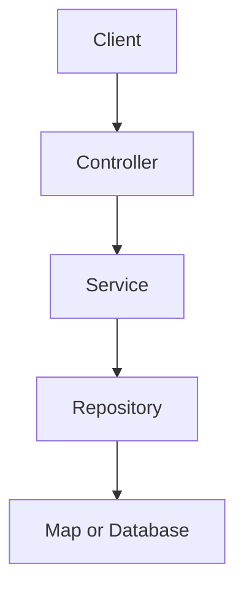

# Day 10 — Service layer and layered architecture

## 🎯 Learning Objectives

By the end of this day you will understand:

- Why controllers must not contain business rules or Maps
- Controller → Service → Repository flow
- What belongs in each layer (and what must not)
- Constructor injection of the service
- Duplicate-email rule in the service, not the controller

---

# 1. Concept — layers

## What is it?

A **layered architecture** splits an app by responsibility:

```text
Controller  HTTP in/out
Service     business rules, transactions (later)
Repository  persistence
```

## Why do we need it?

Day 9’s controller did **everything**. You cannot reuse “create user” from a CLI or a Kafka listener. You cannot unit-test duplicate-email without HTTP.

## Real-world analogy

Waiter (controller) takes the order. Chef (service) cooks. Pantry (repository) stores ingredients. The waiter does not walk into the freezer.

## Backend example

```text
POST /api/users
  → UserController.create
  → UserService.create   (email unique?)
  → UserRepository.save
  → Map (today) / MySQL (Day 15)
```



---

# 2. What must NOT live where

| Layer | Allowed | Forbidden |
|---|---|---|
| Controller | Map HTTP, call service, set status | SQL, duplicate-email rule, Map storage |
| Service | Rules, orchestration | `HttpServletRequest`, status codes as the primary API (we cheat today with ResponseStatusException; Day 12 replaces it) |
| Repository | save/find | “email already registered” messages |

---

# 3. `ResponseStatusException`

Until Day 12’s `@RestControllerAdvice`, we throw:

```java
throw new ResponseStatusException(HttpStatus.NOT_FOUND, "User not found");
```

Boot maps it to the HTTP status. **This is simplified.** Production uses domain exceptions + a global handler.

---

# 4. How It Works

Spring creates `InMemoryUserRepository` (`@Repository`), injects it into `UserService` (`@Service`), injects that into `UserController`. One graph, same as Day 6’s Clock chain.


---

# Write this on your machine (file by file)

Do **not** copy-paste the whole answer-key folder. Create each file on your laptop, in order.

Suggested folder:

```bash
mkdir -p ~/springboot-practice/day-10
cd ~/springboot-practice/day-10
```

Answer key: `java-springboot-backend/practical/day-10/`

Package `com.course.day10`. Five types: User, repository interface + impl, service, controller.

| # | File | Why it exists |
|---|---|---|
| 1 | `User.java` | same POJO as Day 9 |
| 2 | `UserRepository.java` | interface |
| 3 | `InMemoryUserRepository.java` | @Repository Map |
| 4 | `UserService.java` | rules |
| 5 | `UserController.java` | HTTP only |
| 6 | `Day10Application.java` | main |

```bash
mvn spring-boot:run
curl -s -X POST http://localhost:8080/api/users -H 'Content-Type: application/json' -d '{"name":"Ada","email":"ada@example.com"}'
curl -s -X POST http://localhost:8080/api/users -H 'Content-Type: application/json' -d '{"name":"Ada2","email":"ada@example.com"}'
```

Type each file from the answer key **in the table order**. Compile after repository+service exist so the controller can inject them.

Second POST with the same email should be **409**.

Controller methods are short. If a controller method grows past a few lines, the extra probably belongs in the service.


---

# Common Mistakes

1. **Injecting the repository into the controller** and skipping the service “because it’s faster”.
2. **Calling `new InMemoryUserRepository()` in the service.**
3. **HTTP status logic duplicated** in every method — Day 12.
4. **Repository throwing 409** — that’s a business rule.
5. **Fat controllers.**

---

# Practical Exercise

1. Add `searchByName` in repository+service+GET `?name=`.
2. Unit-style: `new UserService(new InMemoryUserRepository())` in a `main` without HTTP.
3. Move `existsByEmail` check; confirm controller has no if-email.
4. Draw the package diagram.
5. Explain why @Repository is on the impl, not the interface.

---

# Mini Project

Add `UserService.updateEmail(id, email)` used by PUT or a dedicated endpoint. Keep uniqueness in the service.

---

# Interview Questions

## Easy

### Q1. What is a service layer?

**Difficulty:** Easy

**Answer:**

The place for business use-cases. Controllers call it; it calls repositories.

**Simple Explanation:**

The chef.

**Example:**

```java
@Service public class UserService {}
```

**Interview Tip:**

No HTTP types here (ideally).

**Common Follow-up Question:**

Can a service call another service? (Yes.)

### Q2. What is a repository?

**Difficulty:** Easy

**Answer:**

An abstraction over storage. save/find/delete.

**Simple Explanation:**

The pantry.

**Example:**

```java
public interface UserRepository {}
```

**Interview Tip:**

Spring Data will implement this later.

**Common Follow-up Question:**

DAO vs repository?

### Q3. Why not put SQL in the controller?

**Difficulty:** Easy

**Answer:**

You’d couple HTTP to a vendor, can’t reuse, hard to test, messy.

**Simple Explanation:**

Waiter doesn’t cook SQL.

**Example:**

Layers

**Interview Tip:**

Interviews love this.

**Common Follow-up Question:**

What about @Query in controllers? (Never.)

### Q4. Who creates UserService?

**Difficulty:** Easy

**Answer:**

Spring, because @Service + constructor.

**Simple Explanation:**

The container.

**Example:**

Day 3–6

**Interview Tip:**

Single constructor.

**Common Follow-up Question:**

Could you new it in tests? (Yes.)

### Q5. What does 409 mean here?

**Difficulty:** Easy

**Answer:**

Duplicate email — conflict with current state.

**Simple Explanation:**

Already registered.

**Example:**

existsByEmail

**Interview Tip:**

Unique index later.

**Common Follow-up Question:**

400 vs 409.

## Medium

### Q1. Why an interface for the repository if only one impl?

**Difficulty:** Medium

**Answer:**

Tests, future JPA, documents the port. Optional for tiny apps; this course always uses it.

**Simple Explanation:**

A socket.

**Example:**

UserRepository

**Interview Tip:**

Spring Data makes the impl.

**Common Follow-up Question:**

Don’t interface every DTO.

### Q2. ResponseStatusException pros/cons?

**Difficulty:** Medium

**Answer:**

Quick status mapping; leaks HTTP into the service. Prefer domain exceptions + advice.

**Simple Explanation:**

A temporary bridge.

**Example:**

getById

**Interview Tip:**

Day 12

**Common Follow-up Question:**

Checked exceptions? (No.)

### Q3. Can the controller return ResponseEntity and the service return User?

**Difficulty:** Medium

**Answer:**

Yes — that’s the split: service returns domain, controller wraps HTTP.

**Simple Explanation:**

Different languages of the layers.

**Example:**

create() returns User

**Interview Tip:**

Don’t return ResponseEntity from the service.

**Common Follow-up Question:**

Void delete.

### Q4. Transaction boundary?

**Difficulty:** Medium

**Answer:**

Usually the service method (Day 17 @Transactional). Repository methods are too fine or too leaky.

**Simple Explanation:**

One use-case, one transaction.

**Example:**

create user + welcome email later

**Interview Tip:**

Don’t @Transactional on controllers.

**Common Follow-up Question:**

Self-invocation.

### Q5. What if two services need the same repository?

**Difficulty:** Medium

**Answer:**

Both inject UserRepository. Don’t make services singletons that hold request data.

**Simple Explanation:**

Shared pantry, two chefs.

**Example:**

OrderService + UserService

**Interview Tip:**

Fine.

**Common Follow-up Question:**

Circular service deps.

## Hard

### Q1. Is layered architecture the only option?

**Difficulty:** Hard

**Why?** Relevant to today's topic.

**How?** See answer.

**When?** In production backends and interviews.

**Trade-offs:** Discussed in the answer.

**Real-world example:** This course's practical code.

**Answer:**

No — hexagonal/ports-and-adapters, modular monoliths. Layers are the interview default and Boot’s natural packaging.

**Simple Explanation:**

A good default, not a religion.

**Example:**

controller/service/repository packages

**Interview Tip:**

Don’t over-abstract Day 10.

**Common Follow-up Question:**

When to modularize.

### Q2. How does data flow for GET /api/users/1?

**Difficulty:** Hard

**Why?** Relevant to today's topic.

**How?** See answer.

**When?** In production backends and interviews.

**Trade-offs:** Discussed in the answer.

**Real-world example:** This course's practical code.

**Answer:**

DispatcherServlet → Controller.findById → Service.getById → Repository.findById → Optional empty → exception → 404.

**Simple Explanation:**

Walk the stack.

**Example:**

Mermaid in the lesson

**Interview Tip:**

Draw it.

**Common Follow-up Question:**

Where is Jackson? (On the way out.)

### Q3. Why @Repository on the class not the interface?

**Difficulty:** Hard

**Why?** Relevant to today's topic.

**How?** See answer.

**When?** In production backends and interviews.

**Trade-offs:** Discussed in the answer.

**Real-world example:** This course's practical code.

**Answer:**

Spring must instantiate a class. The interface is the injection type. Component scan looks at the concrete class.

**Simple Explanation:**

You can’t new an interface.

**Example:**

InMemoryUserRepository

**Interview Tip:**

Spring Data generates a class.

**Common Follow-up Question:**

JDK proxies vs CGLIB.

### Q4. How would you test UserService without Boot?

**Difficulty:** Hard

**Why?** Relevant to today's topic.

**How?** See answer.

**When?** In production backends and interviews.

**Trade-offs:** Discussed in the answer.

**Real-world example:** This course's practical code.

**Answer:**

new UserService(new InMemoryUserRepository()) or a fake. Assert 409 on duplicate.

**Simple Explanation:**

That’s why we injected the interface.

**Example:**

No @SpringBootTest required

**Interview Tip:**

Day 27 Mockito

**Common Follow-up Question:**

What’s overkill? Boot test for a pure service.

### Q5. Controller → repository directly: when, if ever?

**Difficulty:** Hard

**Why?** Relevant to today's topic.

**How?** See answer.

**When?** In production backends and interviews.

**Trade-offs:** Discussed in the answer.

**Real-world example:** This course's practical code.

**Answer:**

Almost never for this course. Maybe a trivial health ping. CRUD still has rules (uniqueness, 404).

**Simple Explanation:**

Skip the chef only when there is no cooking.

**Example:**

UserController injecting UserRepository

**Interview Tip:**

Interview: say you’d still use a service.

**Common Follow-up Question:**

CQRS read side exceptions.


---

# Day-End Practice

1. Add `searchByName` in repository+service+GET `?name=`.
2. Unit-style: `new UserService(new InMemoryUserRepository())` in a `main` without HTTP.
3. Move `existsByEmail` check; confirm controller has no if-email.
4. Draw the package diagram.
5. Explain why @Repository is on the impl, not the interface.

---

# Quick Revision

- Controller HTTP, service rules, repository storage.
- Inject down the graph.
- Duplicate email is a service rule.
- ResponseStatusException is temporary.
- Same URLs as Day 9.

---

# What You Should Be Able To Explain

- Layer responsibilities
- Why interface repository
- 409 vs 404
- Injection chain
- Why not new the repository

**Next:** [Day 11](../day-11-dtos/README.md)
