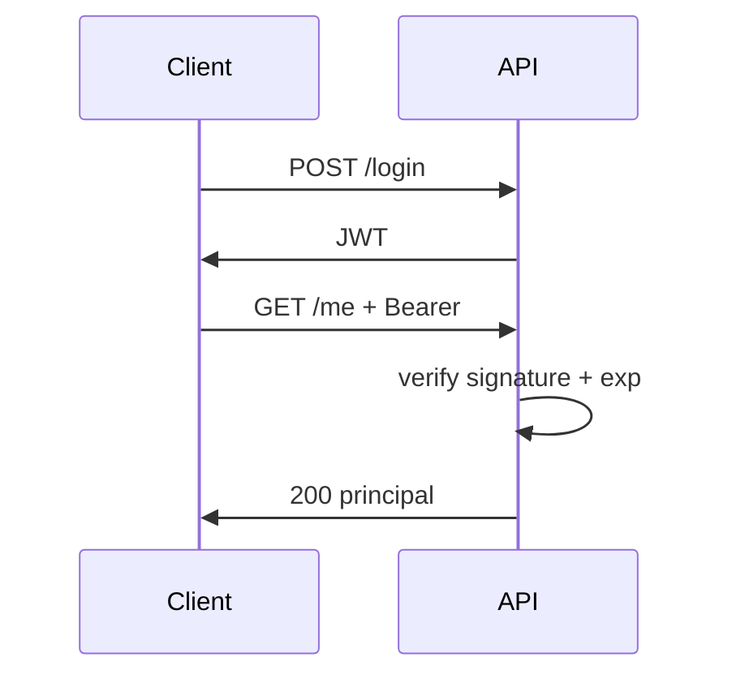

# Day 25 — JWT register, login, and protected routes

## 🎯 Learning Objectives

By the end of this day you will understand:

- JWT header.payload.signature
- Access vs refresh (concept)
- Issue token on login
- Bearer filter
- Stateless session policy

---

# 1. Concept — JWT

```text
header.payload.signature
```

- **Header** — alg, typ
- **Payload** — claims (`sub`, `exp`)
- **Signature** — HMAC with a secret (or RSA)

The server does **not** store the access token (stateless). It verifies the signature and `exp`.

## Flow

```text
POST /api/auth/register
POST /api/auth/login     → { accessToken }
GET  /api/users/me       Authorization: Bearer <token>
```



## Limitations

- Stolen token works until exp (use short TTL + refresh).
- Secret leak = game over. Use env vars, not source control.
- You cannot “log out” a JWT without a denylist or short TTL.

**This is simplified for learning;** production needs refresh tokens, key rotation, and a user table.


---

# Write this on your machine (file by file)

Do **not** copy-paste the whole answer-key folder. Create each file on your laptop, in order.

Suggested folder:

```bash
mkdir -p ~/springboot-practice/day-25
cd ~/springboot-practice/day-25
```

Answer key: `java-springboot-backend/practical/day-25/`

jjwt 0.12.x + security. Type files in order: JwtService, filter, security, controllers.

| # | File | Why it exists |
|---|---|---|
| 1 | `JwtService.java` | issue/parse |
| 2 | `JwtAuthFilter.java` | Bearer |
| 3 | `SecurityConfig.java` | STATELESS |
| 4 | `AuthController.java` | register/login |
| 5 | `MeController.java` | /me |

```bash
mvn spring-boot:run
curl -s -X POST http://localhost:8080/api/auth/register -H 'Content-Type: application/json' -d '{"email":"ada@example.com","password":"secret"}'
TOKEN=$(curl -s -X POST http://localhost:8080/api/auth/login -H 'Content-Type: application/json' -d '{"email":"ada@example.com","password":"secret"}' | python3 -c 'import sys,json;print(json.load(sys.stdin)["accessToken"])')
curl -s http://localhost:8080/api/users/me -H "Authorization: Bearer $TOKEN"
```

Decode the token at jwt.io (use a dummy secret locally). Confirm exp and sub. Hardcoded secret is **demo only**.

---

# Common Mistakes

1. Putting secret in git.
2. No expiration.
3. Session cookies + JWT mixed without thought.
4. Filter not registered.
5. Logging full tokens.

---

# Practical Exercise

1. Register, login, me.
2. Me without token → 401.
3. Tamper payload → 401.
4. Wait for exp (shorten to 5s as extra).
5. Explain three JWT parts.

---

# Mini Project

Add a refresh token map (in-memory) POST /api/auth/refresh.

---

# Interview Questions

## Easy

### Q1. JWT structure?

**Difficulty:** Easy

**Answer:**

header.payload.signature

**Simple Explanation:**

header.

**Example:**

```text
See today's practical code.
```

**Interview Tip:**

Tie it to today's files.

**Common Follow-up Question:**

Ask for a real example.

### Q2. Claim sub?

**Difficulty:** Easy

**Answer:**

Subject — usually user id or email.

**Simple Explanation:**

Subject — usually user id or email.

**Example:**

```text
See today's practical code.
```

**Interview Tip:**

Tie it to today's files.

**Common Follow-up Question:**

Ask for a real example.

### Q3. Why signature?

**Difficulty:** Easy

**Answer:**

Detect tampering; prove issuer with the secret/key.

**Simple Explanation:**

Detect tampering; prove issuer with the secret/key.

**Example:**

```text
See today's practical code.
```

**Interview Tip:**

Tie it to today's files.

**Common Follow-up Question:**

Ask for a real example.

### Q4. Stateless?

**Difficulty:** Easy

**Answer:**

Server doesn’t store access tokens.

**Simple Explanation:**

Server doesn’t store access tokens.

**Example:**

```text
See today's practical code.
```

**Interview Tip:**

Tie it to today's files.

**Common Follow-up Question:**

Ask for a real example.

### Q5. exp?

**Difficulty:** Easy

**Answer:**

Expiration unix time; reject after.

**Simple Explanation:**

Expiration unix time; reject after.

**Example:**

```text
See today's practical code.
```

**Interview Tip:**

Tie it to today's files.

**Common Follow-up Question:**

Ask for a real example.

## Medium

### Q1. Bearer?

**Difficulty:** Medium

**Answer:**

Authorization: Bearer token

**Simple Explanation:**

Authorization: Bearer token.

**Example:**

```text
See today's practical code.
```

**Interview Tip:**

Tie it to today's files.

**Common Follow-up Question:**

Ask for a real example.

### Q2. Access vs refresh?

**Difficulty:** Medium

**Answer:**

Short-lived access; longer refresh to mint new access.

**Simple Explanation:**

Short-lived access; longer refresh to mint new access.

**Example:**

```text
See today's practical code.
```

**Interview Tip:**

Tie it to today's files.

**Common Follow-up Question:**

Ask for a real example.

### Q3. Logout?

**Difficulty:** Medium

**Answer:**

Delete client token; server denylist optional.

**Simple Explanation:**

Delete client token; server denylist optional.

**Example:**

```text
See today's practical code.
```

**Interview Tip:**

Tie it to today's files.

**Common Follow-up Question:**

Ask for a real example.

### Q4. Secret vs asymmetric?

**Difficulty:** Medium

**Answer:**

HMAC shared secret vs RSA/EC private sign public verify.

**Simple Explanation:**

HMAC shared secret vs RSA/EC private sign public verify.

**Example:**

```text
See today's practical code.
```

**Interview Tip:**

Tie it to today's files.

**Common Follow-up Question:**

Ask for a real example.

### Q5. Filter order?

**Difficulty:** Medium

**Answer:**

Before UsernamePasswordAuthenticationFilter.

**Simple Explanation:**

Before UsernamePasswordAuthenticationFilter.

**Example:**

```text
See today's practical code.
```

**Interview Tip:**

Tie it to today's files.

**Common Follow-up Question:**

Ask for a real example.

## Hard

### Q1. SessionCreationPolicy.STATELESS?

**Difficulty:** Hard

**Why?** Relevant to today's topic.

**How?** See answer.

**When?** In production backends and interviews.

**Trade-offs:** Discussed in the answer.

**Real-world example:** This course's practical code.

**Answer:**

No HTTP session for security context.

**Simple Explanation:**

No HTTP session for security context.

**Example:**

```text
See today's practical code.
```

**Interview Tip:**

Tie it to today's files.

**Common Follow-up Question:**

Ask for a real example.

### Q2. alg none attack?

**Difficulty:** Hard

**Why?** Relevant to today's topic.

**How?** See answer.

**When?** In production backends and interviews.

**Trade-offs:** Discussed in the answer.

**Real-world example:** This course's practical code.

**Answer:**

Old libs; never accept unsigned.

**Simple Explanation:**

Old libs; never accept unsigned.

**Example:**

```text
See today's practical code.
```

**Interview Tip:**

Tie it to today's files.

**Common Follow-up Question:**

Ask for a real example.

### Q3. Put roles in claims?

**Difficulty:** Hard

**Why?** Relevant to today's topic.

**How?** See answer.

**When?** In production backends and interviews.

**Trade-offs:** Discussed in the answer.

**Real-world example:** This course's practical code.

**Answer:**

Common; keep payload small.

**Simple Explanation:**

Common; keep payload small.

**Example:**

```text
See today's practical code.
```

**Interview Tip:**

Tie it to today's files.

**Common Follow-up Question:**

Ask for a real example.

### Q4. HTTPS?

**Difficulty:** Hard

**Why?** Relevant to today's topic.

**How?** See answer.

**When?** In production backends and interviews.

**Trade-offs:** Discussed in the answer.

**Real-world example:** This course's practical code.

**Answer:**

Required or tokens leak.

**Simple Explanation:**

Required or tokens leak.

**Example:**

```text
See today's practical code.
```

**Interview Tip:**

Tie it to today's files.

**Common Follow-up Question:**

Ask for a real example.

### Q5. Hardcoded secret?

**Difficulty:** Hard

**Why?** Relevant to today's topic.

**How?** See answer.

**When?** In production backends and interviews.

**Trade-offs:** Discussed in the answer.

**Real-world example:** This course's practical code.

**Answer:**

Never in production.

**Simple Explanation:**

Never in production.

**Example:**

```text
See today's practical code.
```

**Interview Tip:**

Tie it to today's files.

**Common Follow-up Question:**

Ask for a real example.


---

# Day-End Practice

1. Register, login, me.
2. Me without token → 401.
3. Tamper payload → 401.
4. Wait for exp (shorten to 5s as extra).
5. Explain three JWT parts.

---

# Quick Revision

- Three JWT parts.
- Login issues token.
- Filter sets SecurityContext.
- Stateless.
- Short TTL.

---

# What You Should Be Able To Explain

- JWT parts
- login flow
- Bearer filter
- stateless
- limitations

**Next:** [Day 26](../day-26-authorization-security/README.md)
